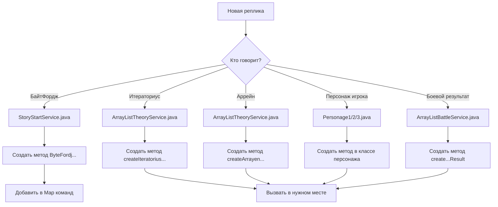

# 🎭 РУКОВОДСТВО ПО РАЗМЕЩЕНИЮ РЕПЛИК ПЕРСОНАЖЕЙ

---

## 📋 СОДЕРЖАНИЕ

1. [Общие принципы](#общие-принципы)
2. [Где писать реплики БайтФорджа](#где-писать-реплики-байтфорджа)
3. [Где писать реплики Итераториуса](#где-писать-реплики-итераториуса)
4. [Где писать реплики Аррейна](#где-писать-реплики-аррейна)
5. [Где писать реплики персонажей игрока](#где-писать-реплики-персонажей-игрока)
6. [Примеры добавления новых реплик](#примеры-добавления-новых-реплик)
7. [Лучшие практики](#лучшие-практики)

---

## 🎯 ОБЩИЕ ПРИНЦИПЫ

### Архитектура диалогов
```
┌─────────────────────────────────────────────────────────────┐
│                    ДИАЛОГИ В ПРОЕКТЕ                      │
├─────────────────────────────────────────────────────────────┤
│                                                             │
│  📝 StoryStartService                                       │
│  ├── БайтФордж (наставник)                                 │
│  └── Начальная сюжетная линия                              │
│                                                             │
│  ⚔️ ArrayListTheoryService                                 │
│  ├── Итераториус (командир)                                │
│  ├── Аррейн (противник)                                    │
│  └── Теория и боевые диалоги                               │
│                                                             │
│  🎮 Personage1/2/3                                        │
│  ├── Карточки персонажей                                   │
│  └── Комментарии от Итераториуса                           │
│                                                             │
│  🔧 ArrayListBattleService                                 │
│  ├── Боевые результаты                                     │
│  └── Комментарии к действиям                               │
│                                                             │
└─────────────────────────────────────────────────────────────┘
```

### Принципы размещения
1. **По персонажу** — каждый персонаж в своем сервисе
2. **По сюжетной линии** — диалоги по этапам истории
3. **По функциональности** — боевые, обучающие, навигационные

---

## 🎭 ГДЕ ПИСАТЬ РЕПЛИКИ БАЙТФОРДЖА

### Файл: `src/main/java/org/example/service/StoryStartService.java`

### Существующие методы:
```java
// Приветствие
public void handleStart(TelegramLongPollingBot bot, Long chatId, Long userId)

// Объяснение симуляции
public static SendMessage ByteFordjProgrammer(Long chatId)

// Ответ на "Какая?"
public static SendMessage sendWhich(Long chatId)

// Наставление
public static SendMessage ByteFordjParting(Long chatId)

// Ответ на "Что будет со мной?"
public static SendMessage ByteFordjAnswerTwo(Long chatId)

// Ответ на "Сбежать от компиляции"
public static SendMessage sendEscapeTwoText(Long chatId)

// Ответ на "Обновить IDE"
public static SendMessage IDEtext(Long chatId)
public static SendMessage IDEtext2(Long chatId)
```

### Как добавить новую реплику БайтФорджа:

```java
// 1. Создай новый метод
public static SendMessage ByteFordjNewMessage(Long chatId) {
    log.info("ByteFordjNewMessage() — вызывается для chatId={}", chatId);
    SendMessage sendMessage = new SendMessage();
    sendMessage.setChatId(chatId);
    sendMessage.setParseMode("Markdown");
    sendMessage.setText("*БайтФордж:*\n\n" +
            "Твоя новая реплика здесь.\n" +
            "Можешь использовать Markdown разметку.");
    
    // Если нужна клавиатура
    sendMessage.setReplyMarkup(KeyboardService.someKeyboard(chatId));
    
    log.info("ByteFordjNewMessage() — сообщение подготовлено и возвращается.");
    return sendMessage;
}

// 2. Добавь в Map команд в методе init()
startCommands.put("Новая кнопка", (bot, msg) -> 
    sendMsg(bot, ByteFordjNewMessage(msg.getChatId())));
```

---

## ⚔️ ГДЕ ПИСАТЬ РЕПЛИКИ ИТЕРАТОРИУСА

### Файл: `src/main/java/org/example/service/ArrayList/ArrayListTheoryService.java`

### Существующие методы:
```java
// Первое сообщение от Итераториуса
public static SendMessage createIteratoriusMessage(Long chatId)

// Предупреждение о противнике
public SendMessage createIteratoriusWarningMessage(Long chatId)

// Боевые подсказки
public SendMessage createRound1Message(Long chatId)
public SendMessage createRound2Message(Long chatId)
public SendMessage createRound3Message(Long chatId)
```

### Как добавить новую реплику Итераториуса:

```java
// 1. Создай новый метод
public SendMessage createIteratoriusNewMessage(Long chatId) {
    log.debug("ArrayListTheoryService: Создание нового сообщения от Итераториуса для chatId={}", chatId);
    
    SendMessage sendMessage = new SendMessage();
    sendMessage.setChatId(chatId);
    sendMessage.setParseMode("Markdown");
    sendMessage.setText("*Итераториус*\n\n" +
            "Твоя новая реплика Итераториуса здесь.\n" +
            "Используй игровой стиль и терминологию.");
    
    log.debug("ArrayListTheoryService: Новое сообщение от Итераториуса создано");
    return sendMessage;
}

// 2. Вызови в нужном месте
bot.execute(theoryService.createIteratoriusNewMessage(chatId));
```

---

## 🗡️ ГДЕ ПИСАТЬ РЕПЛИКИ АРРЕЙНА

### Файл: `src/main/java/org/example/service/ArrayList/ArrayListTheoryService.java`

### Существующие методы:
```java
// Представление Аррейна
public SendMessage createArrayenIntroMessage(Long chatId)

// Информация о производительности
public SendMessage createArrayenInfoMessage(Long chatId)
```

### Как добавить новую реплику Аррейна:

```java
// 1. Создай новый метод
public SendMessage createArrayenNewMessage(Long chatId) {
    log.debug("ArrayListTheoryService: Создание нового сообщения от Аррейна для chatId={}", chatId);
    
    SendMessage sendMessage = new SendMessage();
    sendMessage.setChatId(chatId);
    sendMessage.setParseMode("Markdown");
    sendMessage.setText("*Аррейн*\n\n" +
            "Твоя новая реплика Аррейна здесь.\n" +
            "Используй агрессивный стиль и технические термины.");
    
    log.debug("ArrayListTheoryService: Новое сообщение от Аррейна создано");
    return sendMessage;
}

// 2. Вызови в нужном месте
bot.execute(theoryService.createArrayenNewMessage(chatId));
```

---

## 🎮 ГДЕ ПИСАТЬ РЕПЛИКИ ПЕРСОНАЖЕЙ ИГРОКА

### Файлы персонажей:
- `src/main/java/org/example/model/personage/Personage1.java`
- `src/main/java/org/example/model/personage/Personage2.java`
- `src/main/java/org/example/model/personage/Personage3.java`

### Существующие методы:
```java
// Карточка персонажа
public SendPhoto getSendPhotoTheory(Long chatId)

// Карточка после доспехов
public SendPhoto getRomanArmorCard(Long chatId, int analyticsDelta)
```

### Как добавить новую реплику персонажа:

```java
// В Personage1.java
public SendMessage createPersonage1NewMessage(Long chatId) {
    log.debug("Personage1: Создание нового сообщения для chatId={}", chatId);
    
    SendMessage sendMessage = new SendMessage();
    sendMessage.setChatId(chatId);
    sendMessage.setParseMode("Markdown");
    sendMessage.setText("*" + name + "*\n\n" +
            "Новая реплика персонажа Кодыч.\n" +
            "Можешь использовать характеристики персонажа.");
    
    log.debug("Personage1: Новое сообщение создано");
    return sendMessage;
}
```

---

## 🔧 ГДЕ ПИСАТЬ БОЕВЫЕ РЕЗУЛЬТАТЫ

### Файл: `src/main/java/org/example/service/ArrayList/ArrayListBattleService.java`

### Существующие методы:
```java
// Результат try-catch
public SendMessage createTryCatchResult(Long chatId)

// Результат анализа
public SendMessage createAnalysisResult(Long chatId)

// Результат вставки
public SendMessage createInsertResult(Long chatId)
```

### Как добавить новый боевой результат:

```java
// 1. Создай новый метод
public SendMessage createNewBattleResult(Long chatId, String action) {
    log.debug("ArrayListBattleService: Создание результата боя для chatId={}", chatId);
    
    SendMessage sendMessage = new SendMessage();
    sendMessage.setChatId(chatId);
    sendMessage.setParseMode("Markdown");
    sendMessage.setText("*Итераториус:*\n\n" +
            "Результат действия: " + action + "\n" +
            "Твоя новая боевая реплика здесь.");
    
    log.debug("ArrayListBattleService: Результат боя создан");
    return sendMessage;
}

// 2. Вызови в обработчике команды
bot.execute(battleService.createNewBattleResult(chatId, "Новое действие"));
```

---

## 📝 ПРИМЕРЫ ДОБАВЛЕНИЯ НОВЫХ РЕПЛИК

### Пример 1: Новая реплика БайтФорджа

```java
// В StoryStartService.java
public static SendMessage ByteFordjEncouragement(Long chatId) {
    log.info("ByteFordjEncouragement() — вызывается для chatId={}", chatId);
    SendMessage sendMessage = new SendMessage();
    sendMessage.setChatId(chatId);
    sendMessage.setParseMode("Markdown");
    sendMessage.setText("*БайтФордж:*\n\n" +
            "Ты делаешь большие успехи, новобранец!\n" +
            "Каждый баг — это урок, каждая ошибка — опыт.\n" +
            "Продолжай в том же духе!");
    
    log.info("ByteFordjEncouragement() — сообщение подготовлено и возвращается.");
    return sendMessage;
}

// Добавить в Map команд
startCommands.put("Поощрение", (bot, msg) -> 
    sendMsg(bot, ByteFordjEncouragement(msg.getChatId())));
```

### Пример 2: Новая реплика Итераториуса

```java
// В ArrayListTheoryService.java
public SendMessage createIteratoriusHint(Long chatId) {
    log.debug("ArrayListTheoryService: Создание подсказки от Итераториуса для chatId={}", chatId);
    
    SendMessage sendMessage = new SendMessage();
    sendMessage.setChatId(chatId);
    sendMessage.setParseMode("Markdown");
    sendMessage.setText("*Итераториус*\n\n" +
            "💡 *Подсказка:*\n" +
            "Помни, что ArrayList автоматически расширяется.\n" +
            "Но каждая вставка в середину — дорогая операция!");
    
    log.debug("ArrayListTheoryService: Подсказка от Итераториуса создана");
    return sendMessage;
}
```

### Пример 3: Новая реплика Аррейна

```java
// В ArrayListTheoryService.java
public SendMessage createArrayenThreat(Long chatId) {
    log.debug("ArrayListTheoryService: Создание угрозы от Аррейна для chatId={}", chatId);
    
    SendMessage sendMessage = new SendMessage();
    sendMessage.setChatId(chatId);
    sendMessage.setParseMode("Markdown");
    sendMessage.setText("*Аррейн*\n\n" +
            "Ха! Думаешь, ты меня победишь?\n" +
            "Попробуй вставить элемент в начало — и увидишь, что такое настоящая боль!\n" +
            "Я пересоздам весь массив, и твой код будет плакать!");
    
    log.debug("ArrayListTheoryService: Угроза от Аррейна создана");
    return sendMessage;
}
```

---

## ✅ ЛУЧШИЕ ПРАКТИКИ

### 1. **Структура метода**
```java
public static SendMessage CharacterNameMethod(Long chatId) {
    // 1. Логирование
    log.info("CharacterNameMethod() — вызывается для chatId={}", chatId);
    
    // 2. Создание сообщения
    SendMessage sendMessage = new SendMessage();
    sendMessage.setChatId(chatId);
    sendMessage.setParseMode("Markdown");
    
    // 3. Текст реплики
    sendMessage.setText("*Имя персонажа:*\n\n" +
            "Твоя реплика здесь.\n" +
            "Используй Markdown для форматирования.");
    
    // 4. Клавиатура (если нужна)
    sendMessage.setReplyMarkup(KeyboardService.someKeyboard(chatId));
    
    // 5. Финальное логирование
    log.info("CharacterNameMethod() — сообщение подготовлено и возвращается.");
    return sendMessage;
}
```

### 2. **Именование методов**
```java
// ✅ Хорошо
ByteFordjEncouragement(Long chatId)
createIteratoriusHint(Long chatId)
createArrayenThreat(Long chatId)

// ❌ Плохо
sendMessage1(Long chatId)
createMessage(Long chatId)
newMessage(Long chatId)
```

### 3. **Форматирование текста**
```java
// ✅ Хорошо — с Markdown
sendMessage.setText("*БайтФордж:*\n\n" +
        "Твоя реплика здесь.\n" +
        "_Курсивный текст для акцента._\n" +
        "**Жирный текст для важного.**");

// ❌ Плохо — без форматирования
sendMessage.setText("БайтФордж: Твоя реплика здесь.");
```

### 4. **Логирование**
```java
// ✅ Хорошо — подробное логирование
log.info("ByteFordjEncouragement() — вызывается для chatId={}", chatId);
log.info("ByteFordjEncouragement() — сообщение подготовлено и возвращается.");

// ❌ Плохо — без логирования
// Ничего не пишем
```

### 5. **Обработка ошибок**
```java
// ✅ Хорошо — с try-catch
try {
    bot.execute(sendMessage);
    log.info("Сообщение успешно отправлено");
} catch (TelegramApiException e) {
    log.error("Ошибка отправки сообщения: {}", e.getMessage());
}
```

---

## 🎯 ЗАКЛЮЧЕНИЕ

### Схема размещения реплик:



### Основные правила:
1. **БайтФордж** → `StoryStartService.java`
2. **Итераториус** → `ArrayListTheoryService.java`
3. **Аррейн** → `ArrayListTheoryService.java`
4. **Персонажи игрока** → `Personage1/2/3.java`
5. **Боевые результаты** → `ArrayListBattleService.java`

### Всегда используй:
- ✅ Подробное логирование
- ✅ Markdown форматирование
- ✅ Обработку ошибок
- ✅ Понятные имена методов
- ✅ Комментарии к коду

Теперь ты знаешь, где писать любые реплики персонажей! 🚀 