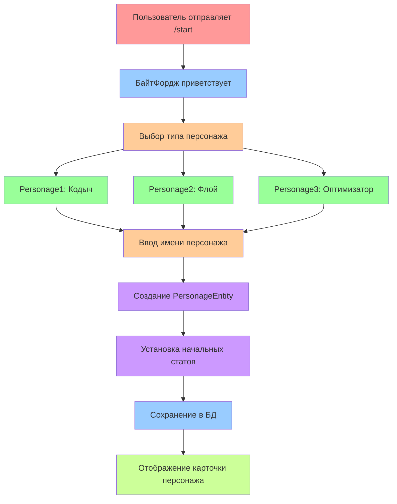

# 👥 ПОЛНЫЙ МАНУАЛ ПО ПЕРСОНАЖАМ

---

## 📋 СОДЕРЖАНИЕ

1. [Обзор системы персонажей](#обзор-системы-персонажей)
2. [Типы персонажей](#типы-персонажей)
3. [Статы и характеристики](#статы-и-характеристики)
4. [Создание персонажа](#создание-персонажа)
5. [Развитие персонажа](#развитие-персонажа)
6. [Техническая реализация](#техническая-реализация)
7. [Примеры кода](#примеры-кода)

---

## 🎭 ОБЗОР СИСТЕМЫ ПЕРСОНАЖЕЙ

### Концепция
Система персонажей построена на **RPG-механиках** с элементами образовательной игры. Каждый персонаж представляет определенный тип программиста с уникальными способностями и стилем игры.

### Архитектура персонажей:
```
┌─────────────────────────────────────────────────────────────┐
│                    СИСТЕМА ПЕРСОНАЖЕЙ                      │
├─────────────────────────────────────────────────────────────┤
│                                                             │
│  👤 PersonageBase (абстрактный класс)                     │
│  ├── Базовые статы и методы                               │
│  ├── Абстрактные методы для подклассов                    │
│  └── Общая логика персонажей                              │
│                                                             │
│  📊 Personage1 — "Кодыч" (Аналитик)                      │
│  ├── Специализация: анализ кода                           │
│  ├── Индивидуальные статы: аналитика, сопротивление       │
│  └── Стиль: методичный, аналитический                     │
│                                                             │
│  💬 Personage2 — "Флой" (Коммуникатор)                   │
│  ├── Специализация: общение с кодом                       │
│  ├── Индивидуальные статы: точность, коммуникация         │
│  └── Стиль: харизматичный, общительный                    │
│                                                             │
│  ⚙️ Personage3 — "Оптимизатор" (Технарь)                 │
│  ├── Специализация: оптимизация кода                      │
│  ├── Индивидуальные статы: точность, оптимизация          │
│  └── Стиль: технический, перфекционист                    │
│                                                             │
└─────────────────────────────────────────────────────────────┘
```

---

## 👤 ТИПЫ ПЕРСОНАЖЕЙ

### 1. 📊 Personage1 — "Кодыч" (Аналитик)

#### Описание:
**"Кодыч"** — это аналитик-программист, который видит код как сложную систему взаимосвязей. Он специализируется на анализе и понимании кода, находит скрытые паттерны и предвидит проблемы до их возникновения.

#### Характеристики:
- **Стиль игры:** Методичный, аналитический
- **Сильные стороны:** Анализ кода, предвидение проблем
- **Слабые стороны:** Медлительность, излишняя осторожность
- **Любимая фраза:** "Давайте сначала проанализируем..."

#### Начальные статы:
```
🏆 Level: 0 → 1
⚡ Энергия: 8
⭐ Очки достижения: 0 → 50
💲 Деньги: 0 → 450
⌚ Сопротивление дедлайну: 90 → 90
📊 Аналитика: 110 → 133-149
```

#### Индивидуальные статы:
- **📊 Аналитика** — способность анализировать код и находить скрытые связи
- **⌚ Сопротивление дедлайну** — устойчивость к стрессу при работе под давлением

### 2. 💬 Personage2 — "Флой" (Коммуникатор)

#### Описание:
**"Флой"** — это коммуникатор-программист, который видит код как язык общения. Он специализируется на написании читаемого кода, хороших комментариев и эффективном взаимодействии с командой.

#### Характеристики:
- **Стиль игры:** Харизматичный, общительный
- **Сильные стороны:** Читаемый код, командная работа
- **Слабые стороны:** Излишняя болтливость, отвлечение от задачи
- **Любимая фраза:** "Код должен говорить сам за себя!"

#### Начальные статы:
```
🏆 Level: 0 → 1
⚡ Энергия: 8
⭐ Очки достижения: 0 → 50
💲 Деньги: 0 → 450
🔍 Точность кода: 140 → 140
💬 Коммуникация: 120 → 143-159
```

#### Индивидуальные статы:
- **🔍 Точность кода** — способность писать безошибочный код
- **💬 Коммуникация** — умение эффективно взаимодействовать с командой

### 3. ⚙️ Personage3 — "Оптимизатор" (Технарь)

#### Описание:
**"Оптимизатор"** — это технарь-программист, который видит код как произведение искусства. Он специализируется на оптимизации производительности, элегантных решениях и техническом совершенстве.

#### Характеристики:
- **Стиль игры:** Технический, перфекционист
- **Сильные стороны:** Оптимизация, техническое мастерство
- **Слабые стороны:** Излишний перфекционизм, медленная разработка
- **Любимая фраза:** "Код должен быть не только рабочим, но и красивым!"

#### Начальные статы:
```
🏆 Level: 0 → 1
⚡ Энергия: 8
⭐ Очки достижения: 0 → 50
💲 Деньги: 0 → 450
🔍 Точность кода: 130 → 130
⚙️ Процесс оптимизации: 160 → 183-199
```

#### Индивидуальные статы:
- **🔍 Точность кода** — способность писать точный и эффективный код
- **⚙️ Процесс оптимизации** — умение оптимизировать производительность

---

## 📊 СТАТЫ И ХАРАКТЕРИСТИКИ

### Базовые статы (общие для всех):

#### 1. 🏆 Level (Уровень)
- **Описание:** Общий уровень развития персонажа
- **Диапазон:** 0 → ∞
- **Влияние:** Открывает новые возможности и контент

#### 2. ⚡ Энергия
- **Описание:** Текущая энергия персонажа
- **Диапазон:** 0-10
- **Влияние:** Ограничивает количество действий в день

#### 3. ⭐ Очки достижения (Achievement Points)
- **Описание:** Опыт персонажа, полученный за действия
- **Диапазон:** 0 → ∞
- **Влияние:** Повышает уровень и открывает новые возможности

#### 4. 💲 Деньги (Currency)
- **Описание:** Игровая валюта персонажа
- **Тип:** Double (поддерживает дробные значения)
- **Диапазон:** 0.0 → ∞
- **Влияние:** Покупка предметов, улучшений

### Индивидуальные статы:

#### Personage1 — Аналитик:
- **📊 Аналитика** — способность анализировать код
- **⌚ Сопротивление дедлайну** — устойчивость к стрессу

#### Personage2 — Коммуникатор:
- **🔍 Точность кода** — способность писать безошибочный код
- **💬 Коммуникация** — умение взаимодействовать с командой

#### Personage3 — Оптимизатор:
- **🔍 Точность кода** — способность писать точный код
- **⚙️ Процесс оптимизации** — умение оптимизировать производительность

---

## 🎮 СОЗДАНИЕ ПЕРСОНАЖА

### Процесс создания:



### Ключевые файлы:

#### 1. StoryStartService.java
   ```java
// Обработка команды /start
public void handleStart(TelegramLongPollingBot bot, Message message)

// Создание персонажа
private void createPersonage(TelegramLongPollingBot bot, Long chatId, String characterType)
```

#### 2. PersonageCreationService.java
   ```java
// Создание персонажа в БД
public PersonageEntity createPersonage(UserEntity user, String characterType, String name)

// Установка начальных статов
private void setInitialStats(PersonageEntity personage, String characterType)
```

#### 3. PersonageService.java
   ```java
// Получение персонажа по ID пользователя
public PersonageEntity getPersonageByUserId(Long userId)

// Обновление статов персонажа
public void updatePersonageStats(PersonageEntity personage)
   ```

---

## 📈 РАЗВИТИЕ ПЕРСОНАЖА

### Система наград:

#### 1. Стандартные награды
```java
// Генерация стандартных наград
Map<String, Integer> rewards = new HashMap<>();
rewards.put("achievement_points", generateRandomReward(30, 60));
rewards.put("currency", generateRandomReward(200, 400));
```

#### 2. Кастомные награды
```java
// Генерация кастомных наград (деньги уменьшаются)
Map<String, Integer> changes = new HashMap<>();
changes.put("money", -generateRandomReward(150, 200));
changes.put("achievement_points", generateRandomReward(30, 50));
```

#### 3. Индивидуальные статы
```java
// Определение индивидуального стата по типу персонажа
public String getIndividualStatForCharacter(String characterType) {
    switch (characterType) {
        case "Personage1":
            return "analytics"; // Аналитика для Personage1
        case "Personage2":
            return "communication"; // Коммуникация для Personage2
        case "Personage3":
            return "code_accuracy"; // Точность кода для Personage3
        default:
            return "analytics";
    }
}
```

### Применение изменений:

```java
// Безопасное применение изменений к персонажу
public void applyStatChanges(Long chatId, Map<String, Integer> changes) {
    UserEntity user = userService.getUserByTgId(chatId);
    PersonageEntity entity = user.getPersonage();
    
    for (Map.Entry<String, Integer> entry : changes.entrySet()) {
        String statName = entry.getKey();
        Integer change = entry.getValue();
        
        switch (statName) {
            case "achievement_points":
                Integer currentAchievement = entity.getAchievementPoints();
                entity.setAchievementPoints((currentAchievement != null ? currentAchievement : 0) + change);
                break;
            case "currency":
                Double currentCurrency = entity.getCurrency();
                entity.setCurrency((currentCurrency != null ? currentCurrency : 0.0) + change);
                break;
            // ... другие статы
        }
    }
    
    userService.saveUser(user);
}
```

---

## 🔧 ТЕХНИЧЕСКАЯ РЕАЛИЗАЦИЯ

### Структура классов:

#### 1. PersonageBase (абстрактный класс)
```java
@MappedSuperclass
public abstract class PersonageBase {
    @Id
    @GeneratedValue(strategy = GenerationType.IDENTITY)
    private Long id;
    
    @Column(name = "name")
    private String name;
    
    @Column(name = "level")
    private Integer level = 0;
    
    @Column(name = "energy")
    private Integer energy = 8;
    
    @Column(name = "achievement_points")
    private Integer achievementPoints = 0;
    
    @Column(name = "currency")
    private Double currency = 0.0;
    
    @Column(name = "character_type")
    private String characterType;
    
    // Абстрактные методы
    public abstract String getRomanArmorCard();
    public abstract String getCharacterDialogue();
}
```

#### 2. PersonageEntity (JPA сущность)
```java
@Entity
@Table(name = "personages")
@Data
@NoArgsConstructor
@AllArgsConstructor
public class PersonageEntity {
    @Id
    @GeneratedValue(strategy = GenerationType.IDENTITY)
    private Long id;
    
    @OneToOne
    @JoinColumn(name = "user_id")
    private UserEntity user;
    
    @Column(name = "name")
    private String name;
    
    @Column(name = "level")
    private Integer level = 0;
    
    @Column(name = "energy")
    private Integer energy = 8;
    
    @Column(name = "achievement_points")
    private Integer achievementPoints = 0;
    
    @Column(name = "currency")
    private Double currency = 0.0;
    
    @Column(name = "character_type")
    private String characterType;
    
    // Индивидуальные статы
    @Column(name = "analytics")
    private Integer analytics;
    
    @Column(name = "optimization")
    private Integer optimization;
    
    @Column(name = "code_accuracy")
    private Integer codeAccuracy;
    
    @Column(name = "communication")
    private Integer communication;
    
    @Column(name = "humor")
    private Integer humor;
    
    @Column(name = "deadline_resistance")
    private Integer deadlineResistance;
    
    @Column(name = "status")
    private String status = "Новобранец";
    
    @Column(name = "tg_id")
    private Long tgId;
}
```

### Репозитории:

#### PersonageRepository.java
```java
@Repository
public interface PersonageRepository extends JpaRepository<PersonageEntity, Long> {
    Optional<PersonageEntity> findByUserId(Long userId);
    Optional<PersonageEntity> findByTgId(Long tgId);
    List<PersonageEntity> findByCharacterType(String characterType);
}
```

---

## 📝 ПРИМЕРЫ КОДА

### Создание карточки персонажа:

#### Personage1.java
```java
@Component
public class Personage1 extends PersonageBase {
    
    @Override
    public String getRomanArmorCard() {
        return String.format(
            "🏛️ *Карточка персонажа*\n\n" +
            "👤 *Имя:* %s\n" +
            "🏆 *Level:* %d\n" +
            "⚡ *Энергия:* %d\n" +
            "⭐ *Очки достижения:* %d\n" +
            "💲 *Деньги:* %.1f\n" +
            "📊 *Аналитика:* %d — Находит скрытые связи в коде\n" +
            "⌚ *Сопротивление дедлайну:* %d — Привык работать под давлением\n\n" +
            "📜 *Комментарий от Итераториуса:* %s",
            getName(), getLevel(), getEnergy(), getAchievementPoints(), 
            getCurrency(), getAnalytics(), getDeadlineResistance(),
            getIteratoriussComment()
        );
    }
    
    @Override
    public String getCharacterDialogue() {
        return "Давайте сначала проанализируем ситуацию...";
    }
    
    private String getIteratoriussComment() {
        return "Не каждый новичок носит доспехи. Но каждый герой — начинал c них. " +
               "Держи +" + getAnalytics() + " к 📊 аналитике, за храбрость!";
    }
}
```

### Обновление статов:

#### StatService.java
  ```java
@Service
@Slf4j
@RequiredArgsConstructor
public class StatService {
    
    private final UserService userService;
    
    public void applyStatChanges(Long chatId, Map<String, Integer> changes) {
        log.info("StatService: Применение изменений статов для chatId={}", chatId);
        
        UserEntity user = userService.getUserByTgId(chatId);
        if (user == null || user.getPersonage() == null) {
            log.warn("StatService: Пользователь или персонаж не найден для chatId={}", chatId);
            return;
        }
        
        PersonageEntity entity = user.getPersonage();
        
        for (Map.Entry<String, Integer> entry : changes.entrySet()) {
            String statName = entry.getKey();
            Integer change = entry.getValue();
            
            applyStatChange(entity, statName, change);
        }
        
        userService.saveUser(user);
        log.info("StatService: Изменения статов применены для chatId={}", chatId);
    }
    
    private void applyStatChange(PersonageEntity entity, String statName, Integer change) {
        switch (statName) {
            case "achievement_points":
                Integer currentAchievement = entity.getAchievementPoints();
                entity.setAchievementPoints((currentAchievement != null ? currentAchievement : 0) + change);
                log.debug("StatService: Изменены очки достижения на {} для chatId={}", change, entity.getTgId());
                break;
            case "currency":
                Double currentCurrency = entity.getCurrency();
                entity.setCurrency((currentCurrency != null ? currentCurrency : 0.0) + change);
                log.debug("StatService: Изменена валюта на {} для chatId={}", change, entity.getTgId());
                break;
            case "analytics":
                Integer currentAnalytics = entity.getAnalytics();
                entity.setAnalytics((currentAnalytics != null ? currentAnalytics : 0) + change);
                log.debug("StatService: Изменена аналитика на {} для chatId={}", change, entity.getTgId());
                break;
            // ... другие статы
        }
    }
}
```

---

## 🚀 ЗАКЛЮЧЕНИЕ

### Ключевые особенности системы персонажей:

1. **Разнообразие** — три уникальных типа персонажей
2. **Специализация** — каждый персонаж имеет свои сильные стороны
3. **Развитие** — система наград и прогрессии
4. **Персонализация** — индивидуальные статы и диалоги
5. **Баланс** — сбалансированные характеристики

### Преимущества архитектуры:

- ✅ **Модульность** — каждый персонаж в отдельном классе
- ✅ **Расширяемость** — легко добавлять новые типы персонажей
- ✅ **Гибкость** — настраиваемые статы и характеристики
- ✅ **Читаемость** — понятная структура классов
- ✅ **Тестируемость** — изолированная логика персонажей

### Где добавлять новые персонажи:

1. **Создай новый класс** — наследуй от PersonageBase
2. **Добавь в репозиторий** — PersonageRepository
3. **Обнови сервисы** — PersonageService, StatService
4. **Добавь диалоги** — в соответствующий класс персонажа
5. **Обнови UI** — StoryStartService для выбора персонажа

**Автор: Архитектор (который знает, что хороший персонаж — это как хороший друг: уникальный, интересный и с характером)** 😄 