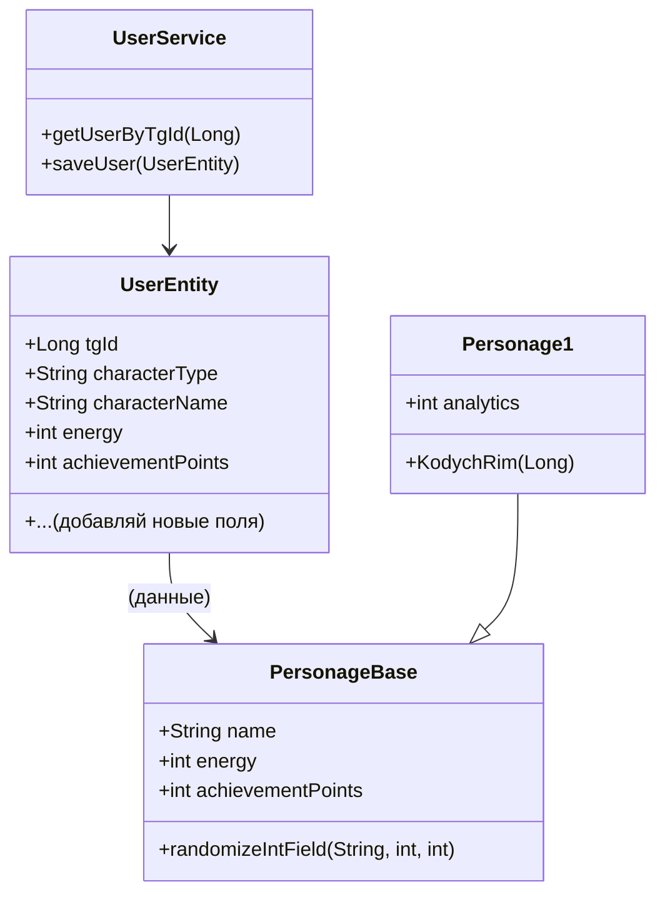

# MANUAL: Как менять характеристики персонажа, делать рандом и показывать это пользователю

---

## 1. Как устроено хранение характеристик
- Все характеристики (energy, achievementPoints, analytics и т.д.) — это поля в PersonageBase и его наследниках (Personage1, Personage2, ...).
- Для сохранения между сессиями — дублируй нужные поля в UserEntity и обновляй их после изменений.

---

## 2. Как изменить характеристику вручную
```java
personage.changeAchievementPoints(10); // +10 очков достижений
personage.energy(-3); // -3 энергии
```

---

## 3. Как сделать рандомное изменение (универсально!)

В PersonageBase теперь есть метод:
```java
int delta = personage.randomizeIntField("analytics", 18, 29); // +рандом от 18 до 29 к аналитике
```
- Работает с любым int-полем ("energy", "achievementPoints", "analytics", ...)
- Логирует: что, на сколько и как изменилось
- Если поле не найдено — пишет ошибку в лог

---

## 4. Как вывести пользователю, что у него изменилось
```java
int delta = personage.randomizeIntField("analytics", 18, 29);
SendPhoto photo = personage.KodychRim(chatId);
bot.execute(photo);
if (delta != 0) {
    SendMessage msg = new SendMessage(chatId.toString(),
        (delta > 0 ? "Тебе добавлено " : "У тебя отняли ") + Math.abs(delta) + " очков аналитики!");
    bot.execute(msg);
}
```

---

## 5. Как сохранить изменения в БД
- После изменения характеристик — обнови UserEntity:
```java
user.setAchievementPoints(personage.getAchievementPoints());
user.setEnergy(personage.getEnergy());
userService.saveUser(user);
```

---

## 6. Как добавить новую характеристику
1. Добавь поле в PersonageBase/Personage1 и UserEntity
2. Добавь миграцию в БД (ALTER TABLE ...)
3. Используй randomizeIntField("имяПоля", min, max) для рандома

---

## 7. Схема (UML)


---

## 8. FAQ
- **Q: Можно ли менять любые поля?**
  - A: Только int! Для других типов — пиши отдельный метод.
- **Q: Что если поле не найдено?**
  - A: Будет ошибка в логах, ничего не сломается.
- **Q: Как сделать рандом с отрицательным диапазоном?**
  - A: Просто укажи min < 0, max > 0 (например, -5, 10).
- **Q: Как добавить характеристику, чтобы она сохранялась?**
  - A: Добавь в UserEntity, обновляй после изменений.

---

## 9. Пример полной цепочки
```java
UserEntity user = userService.getUserByTgId(tgId);
Personage1 personage = new Personage1();
personage.setName(user.getCharacterName());
// ... подставь остальные поля
int delta = personage.randomizeIntField("analytics", 18, 29);
user.setAchievementPoints(personage.getAchievementPoints());
userService.saveUser(user);
SendPhoto photo = personage.KodychRim(chatId);
bot.execute(photo);
if (delta != 0) {
    SendMessage msg = new SendMessage(chatId.toString(),
        (delta > 0 ? "Тебе добавлено " : "У тебя отняли ") + Math.abs(delta) + " очков аналитики!");
    bot.execute(msg);
}
```

---

## 10. Чёрный юмор и советы
- Не забудь обновлять UserEntity, иначе после рестарта у пользователя будет "синдром потерянных очков".
- Не пытайся рандомить String — Архитектор тебя найдёт.
- Если не понял — перечитай мануал, потом спроси у Архитектора. 