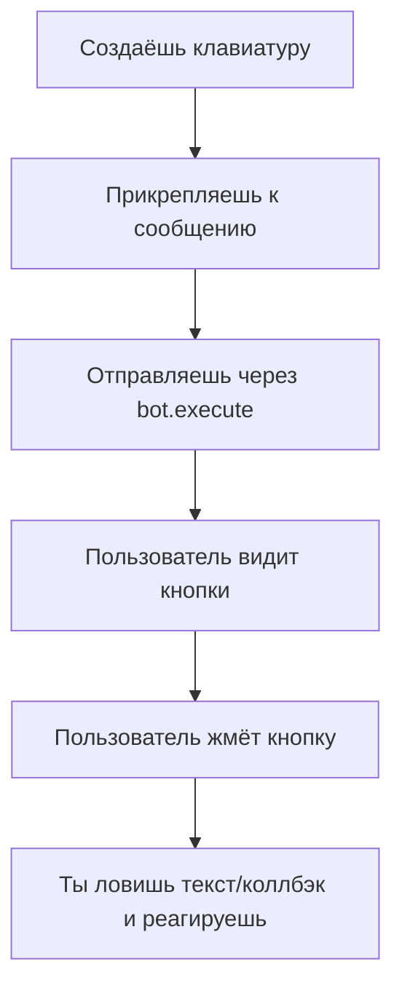

# МАНУАЛ ДЛЯ ДЕТЕЙ, ДЖУНОВ И ВЫГОРЕВШИХ СЕНЬОРОВ: КНОПКИ В TELEGRAM-БОТЕ НА JAVA

---

## 0. ВСТУПЛЕНИЕ

> "Если ты не умеешь делать кнопки в Telegram-боте — не переживай, ты не один. Даже Архитектор иногда забывает, как это работает."

В этом мануале ты узнаешь, как создавать, прикреплять и отправлять кнопки в Telegram-боте на Java так, чтобы даже твоя бабушка смогла объяснить это твоему коту.

---

## 1. КАКИЕ БЫВАЮТ КНОПКИ?

- **ReplyKeyboardMarkup** — обычные кнопки под строкой ввода (как калькулятор, только без денег и смысла жизни).
- **InlineKeyboardMarkup** — кнопки прямо под сообщением (их можно ловить через callback, как баги в пятницу вечером).

---

## 2. КАК СОЗДАТЬ КНОПКУ (ReplyKeyboardMarkup)?

### 2.1. Пример метода:
```java
public static ReplyKeyboardMarkup makeMyKeyboard() {
    ReplyKeyboardMarkup keyboard = new ReplyKeyboardMarkup();
    keyboard.setResizeKeyboard(true); // чтобы кнопки не были размером с твою самооценку
    keyboard.setOneTimeKeyboard(true); // исчезают после нажатия, как отпуск

    KeyboardRow row = new KeyboardRow();
    row.add(new KeyboardButton("Кнопка 1"));
    row.add(new KeyboardButton("Кнопка 2"));
    keyboard.setKeyboard(List.of(row));
    return keyboard;
}
```

---

## 3. КАК ПРИКРЕПИТЬ КНОПКУ К СООБЩЕНИЮ?

### 3.1. К текстовому сообщению:
```java
SendMessage message = new SendMessage();
message.setChatId(chatId);
message.setText("Выбери вариант:");
message.setReplyMarkup(makeMyKeyboard());
bot.execute(message); // Только так кнопки увидит пользователь!
```

### 3.2. К фото:
```java
SendPhoto photo = new SendPhoto();
photo.setChatId(chatId);
photo.setPhoto(new InputFile("https://example.com/photo.jpg"));
photo.setCaption("Фото с кнопками!");
photo.setReplyMarkup(makeMyKeyboard());
bot.execute(photo);
```

---

## 4. КАК ОТПРАВИТЬ КНОПКИ ОТДЕЛЬНЫМ СООБЩЕНИЕМ?

1. Сначала отправь фото (или текст):
   ```java
   bot.execute(sendByteFordj(chatId));
   ```
2. Потом отправь отдельное сообщение с кнопками:
   ```java
   SendMessage message = new SendMessage();
   message.setChatId(chatId);
   message.setText("Что делать дальше?");
   message.setReplyMarkup(makeMyKeyboard());
   bot.execute(message);
   ```

---

## 5. КАК ОБРАБАТЫВАТЬ ОТВЕТЫ НА КНОПКИ?

- Для **ReplyKeyboardMarkup**: просто жди текст, который совпадает с текстом кнопки.
- Для **InlineKeyboardMarkup**: лови callbackQuery и смотри, что там в data.

### Пример для ReplyKeyboardMarkup:
```java
@Override
public void onUpdateReceived(Update update) {
    if (update.hasMessage() && update.getMessage().hasText()) {
        String text = update.getMessage().getText();
        if ("Кнопка 1".equals(text)) {
            // Пользователь нажал Кнопка 1
        }
    }
}
```

---

## 6. СХЕМА (для пятилетних и уставших взрослых)



---

## 7. ЧАСТЫЕ ОШИБКИ (и как не стать их жертвой)

- ❌ **Создал клавиатуру, но не прикрепил к сообщению** — пользователь увидит только пустоту и свою тоску.
- ❌ **Прикрепил клавиатуру к SendMessage, но не установил chatId** — Telegram пошлёт тебя далеко.
- ❌ **Пытаешься отправить клавиатуру как отдельное сообщение** — всегда прикрепляй к SendMessage или SendPhoto.
- ❌ **Путаешь ReplyKeyboardMarkup и InlineKeyboardMarkup** — одна ловится по тексту, другая по callback.

---

## 8. СОВЕТЫ ПО АРХИТЕКТУРЕ

- Делай отдельные методы для каждой клавиатуры в KeyboardService.
- Не пихай отправку сообщений в сервисы, пусть этим занимается только Bot.
- Не бойся экспериментировать — хуже, чем баги в пятницу, уже не будет.

---

## 9. ЧЁРНЫЙ ЮМОР ДЛЯ ЗАПОМИНАНИЯ

- "Если твои кнопки не работают — значит, ты не прикрепил их к сообщению. Или ты просто устал."
- "Кнопки без chatId — как кофе без кофеина: вроде есть, а толку ноль."
- "Если ты отправил клавиатуру, но не через bot.execute — поздравляю, ты только что отправил её в никуда."

---

## 10. ПРИМЕР ПОЛНОГО ЦИКЛА (КОПИПАСТЬ БЕЗ СТЫДА)

```java
// 1. Создаём клавиатуру
ReplyKeyboardMarkup keyboard = KeyboardService.makeMyKeyboard();

// 2. Создаём сообщение
SendMessage message = new SendMessage();
message.setChatId(chatId);
message.setText("Выбери путь:");
message.setReplyMarkup(keyboard);

// 3. Отправляем
bot.execute(message);

// 4. Ловим ответ
@Override
public void onUpdateReceived(Update update) {
    if (update.hasMessage() && update.getMessage().hasText()) {
        String text = update.getMessage().getText();
        if ("Кнопка 1".equals(text)) {
            // Действие для Кнопка 1
        }
    }
}
```

---

## 11. ЕСЛИ ЧТО-ТО НЕ РАБОТАЕТ

- Проверь, что chatId установлен.
- Проверь, что клавиатура прикреплена к сообщению.
- Проверь, что ты отправляешь через bot.execute.
- Проверь, что ты не перепутал типы клавиатур.
- Если всё равно не работает — иди попей чаю, потом возвращайся и перечитай этот мануал.

---

**Удачи! Пусть твои кнопки всегда нажимаются, а баги обходят стороной!** 