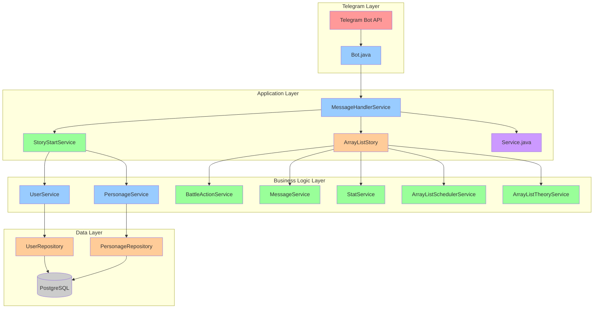

# 🚀 ПОЛНЫЙ МАНУАЛ ПРОЕКТА TELEGRAM-БОТА

---

## 📋 СОДЕРЖАНИЕ

1. [Обзор проекта](#обзор-проекта)
2. [Технологический стек](#технологический-стек)
3. [Архитектура системы](#архитектура-системы)
4. [Структура проекта](#структура-проекта)
5. [Основные компоненты](#основные-компоненты)
6. [База данных](#база-данных)
7. [Развертывание](#развертывание)
8. [Разработка](#разработка)

---

## 🎯 ОБЗОР ПРОЕКТА

### Концепция
**Telegram-бот для изучения Java коллекций** через интерактивную RPG-игру в стиле древнего Рима. Пользователи создают персонажей-программистов и сражаются с коллекциями, изучая их особенности через игровой процесс.

### Основные возможности:
- ✅ **Создание персонажей** — три уникальных типа программистов
- ✅ **Интерактивное обучение** — изучение ArrayList через боевую систему
- ✅ **Система наград** — развитие персонажей через игровой процесс
- ✅ **Диалоги и сюжет** — погружение в мир программирования
- ✅ **Статистика и прогресс** — отслеживание развития персонажа

### Целевая аудитория:
- Начинающие программисты
- Студенты, изучающие Java
- Любители геймификации обучения

---

## 🛠️ ТЕХНОЛОГИЧЕСКИЙ СТЕК

### Основные технологии:

#### 1. **Java 24**
- Современная версия Java
- Использование новейших возможностей языка
- Высокая производительность

#### 2. **Spring Boot 3.5.0**
- Современный фреймворк для разработки
- Автоконфигурация и упрощенная разработка
- Встроенная поддержка веб-приложений

#### 3. **Telegram Bots API 6.9.7.1**
- Официальная библиотека для Telegram Bot API
- Поддержка всех возможностей Telegram
- Стабильная и надежная работа

#### 4. **PostgreSQL + JPA/Hibernate**
- Надежная реляционная база данных
- ORM для удобной работы с данными
- Поддержка сложных запросов

#### 5. **Lombok**
- Уменьшение boilerplate кода
- Автоматическая генерация методов
- Улучшение читаемости кода

#### 6. **SLF4J**
- Современная система логирования
- Гибкая настройка уровней логирования
- Высокая производительность

### Дополнительные технологии:

#### 7. **ScheduledExecutorService**
- Планирование отложенных задач
- Асинхронное выполнение операций
- Управление таймерами и событиями

#### 8. **Maven**
- Управление зависимостями
- Сборка проекта
- Управление жизненным циклом

---

## 🏗️ АРХИТЕКТУРА СИСТЕМЫ

### Общая архитектура:



### Принципы архитектуры:

#### 1. **Модульность**
- Каждый компонент отвечает за свою область
- Четкое разделение ответственности
- Легкое тестирование и поддержка

#### 2. **Масштабируемость**
- Легкое добавление новых функций
- Расширяемая архитектура
- Поддержка новых типов персонажей

#### 3. **Читаемость**
- Понятная структура кода
- Подробные комментарии
- Следование принципам SOLID

#### 4. **Производительность**
- Эффективная обработка сообщений
- Оптимизированные запросы к БД
- Асинхронное выполнение задач

---

## 📁 СТРУКТУРА ПРОЕКТА

### Основные пакеты:

```
src/main/java/org/example/
├── App.java                          # Точка входа приложения
├── Config.java                       # Конфигурация приложения
├── MarkdownUtil.java                 # Утилиты для Markdown
├── Service.java                      # Общие сервисы
│
├── bot/                              # Telegram Bot компоненты
│   ├── Bot.java                     # Основной класс бота
│   ├── MessageHandlerService.java    # Обработчик сообщений
│   ├── CallbackQueryHandlerService.java # Обработчик callback
│   └── KeyboardService/              # Клавиатуры
│       ├── KeyboardReam.java        # Создание клавиатур
│       └── KeyboardService.java     # Сервис клавиатур
│
├── model/                            # Модели данных
│   ├── entity/                       # JPA сущности
│   │   ├── UserEntity.java          # Пользователи
│   │   └── PersonageEntity.java     # Персонажи
│   └── personage/                    # Классы персонажей
│       ├── PersonageBase.java       # Базовый класс
│       ├── Personage1.java          # Аналитик
│       ├── Personage2.java          # Коммуникатор
│       └── Personage3.java          # Оптимизатор
│
├── repository/                       # Репозитории
│   ├── UserRepository.java          # Репозиторий пользователей
│   └── PersonageRepository.java     # Репозиторий персонажей
│
└── service/                          # Бизнес-логика
    ├── StoryStartService.java        # Создание персонажей
    ├── UserService.java             # Управление пользователями
    ├── PersonageService.java        # Управление персонажами
    ├── PersonageCreationService.java # Создание персонажей
    ├── ArrayListStoryService.java   # Устаревший сервис
    ├── PhotoService/                 # Работа с фото
    │   ├── PhotoReam.java          # Создание фото
    │   └── PhotoStart.java         # Начальные фото
    └── ArrayList/                   # ArrayList функциональность
        ├── ArrayListStory.java      # Фасад ArrayList
        ├── BattleActionService.java # Боевые действия
        ├── MessageService.java      # Создание сообщений
        ├── StatService.java         # Управление статами
        ├── ArrayListSchedulerService.java # Планировщик
        └── ArrayListTheoryService.java # Теория и диалоги
```

### Ключевые файлы:

#### 1. **App.java** — Точка входа
```java
@SpringBootApplication
public class App {
    public static void main(String[] args) {
        SpringApplication.run(App.class, args);
    }
}
```

#### 2. **Bot.java** — Основной класс бота
```java
@Component
public class Bot extends TelegramLongPollingBot {
    @Override
    public void onUpdateReceived(Update update) {
        // Обработка обновлений от Telegram
    }
}
```

#### 3. **MessageHandlerService.java** — Маршрутизация
```java
@Service
public class MessageHandlerService {
    public void handleMessage(TelegramLongPollingBot bot, Message message) {
        // Маршрутизация сообщений к соответствующим сервисам
    }
}
```

---

## 🔧 ОСНОВНЫЕ КОМПОНЕНТЫ

### 1. 🎮 StoryStartService
**Назначение:** Создание персонажей и начальная сюжетная линия

**Ключевые методы:**
```java
// Обработка команды /start
public void handleStart(TelegramLongPollingBot bot, Message message)

// Создание персонажа
private void createPersonage(TelegramLongPollingBot bot, Long chatId, String characterType)

// Диалоги БайтФорджа
public static SendMessage ByteFordjProgrammer(Long chatId)
public static SendMessage sendWhich(Long chatId)
public static SendMessage ByteFordjParting(Long chatId)
```

### 2. ⚔️ ArrayListStory (фасад)
**Назначение:** Маршрутизация команд ArrayList

**Ключевые методы:**
```java
// Обработка сообщений
public void handleMessage(TelegramLongPollingBot bot, Message message)

// Маршрутизация команд
private void initializeCommands()
```

### 3. 📊 StatService
**Назначение:** Управление статами персонажей

**Ключевые методы:**
```java
// Генерация случайных наград
public int generateRandomReward(int min, int max)

// Применение изменений к персонажу
public void applyStatChanges(Long chatId, Map<String, Integer> changes)

// Определение индивидуальных статов
public String getIndividualStatForCharacter(String characterType)
```

### 4. 💬 MessageService
**Назначение:** Создание сообщений

**Ключевые методы:**
```java
// Создание боевых сообщений
public SendMessage createTryCatchDefenseMessage(Long chatId)
public SendMessage createAnalysisMessage(Long chatId)
public SendMessage createInsertBeginningMessage(Long chatId)

// Создание сообщений с результатами
public SendMessage createTryCatchResultMessage(Long chatId, Map<String, Integer> rewards)
public SendMessage createAnalysisResultMessage(Long chatId, int expReward, int cashReward)
public SendMessage createInsertBeginningResultMessage(Long chatId, Map<String, Integer> statChanges)
```

### 5. ⚔️ BattleActionService
**Назначение:** Обработка боевых действий

**Ключевые методы:**
```java
// Обработка боевых действий
public void processTryCatchAction(TelegramLongPollingBot bot, Long chatId)
public void processAnalysisAction(TelegramLongPollingBot bot, Long chatId)
public void processInsertBeginningAction(TelegramLongPollingBot bot, Long chatId)

// Проверки возможности участия
public boolean canParticipateInBattle(Long chatId)
public Map<String, Object> getBattleStats(Long chatId)
```

### 6. ⏰ ArrayListSchedulerService
**Назначение:** Планирование событий

**Ключевые методы:**
```java
// Отложенные события
public void sendInsertBeginningResult(TelegramLongPollingBot bot, Long chatId)
public void answerIteratoriys(TelegramLongPollingBot bot, Long chatId)

// Автоматическое удаление сообщений
public void sendTheoryWithAutoDelete(TelegramLongPollingBot bot, Long chatId)
```

### 7. 📚 ArrayListTheoryService
**Назначение:** Теория и диалоги

**Ключевые методы:**
```java
// Теория ArrayList
public String formatArrayListInfo()

// Диалоги персонажей
public SendMessage createEnemyWarningMessage(Long chatId)
public SendMessage createEnemyIntroductionMessage(Long chatId)
public SendMessage createEnemyAttackMessage(Long chatId)
```

---

## 🗄️ БАЗА ДАННЫХ

### Схема базы данных:

#### Таблица USERS:
```sql
CREATE TABLE users (
    id BIGINT PRIMARY KEY AUTO_INCREMENT,
    tg_id BIGINT UNIQUE NOT NULL,
    username VARCHAR(255),
    current_story VARCHAR(255),
    passed_array_list BOOLEAN DEFAULT FALSE,
    state VARCHAR(255)
);
```

#### Таблица PERSONAGES:
  ```sql
CREATE TABLE personages (
    id BIGINT PRIMARY KEY AUTO_INCREMENT,
    user_id BIGINT NOT NULL,
    name VARCHAR(255),
    level INTEGER DEFAULT 0,
    energy INTEGER DEFAULT 8,
    achievement_points INTEGER DEFAULT 0,
    currency DOUBLE DEFAULT 0.0,
    character_type VARCHAR(255),
    analytics INTEGER,
    optimization INTEGER,
    code_accuracy INTEGER,
    communication INTEGER,
    humor INTEGER,
    deadline_resistance INTEGER,
    status VARCHAR(255) DEFAULT 'Новобранец',
    tg_id BIGINT,
    FOREIGN KEY (user_id) REFERENCES users(id)
);
```

### JPA сущности:

#### UserEntity.java:
```java
@Entity
@Table(name = "users")
@Data
@NoArgsConstructor
@AllArgsConstructor
public class UserEntity {
    @Id
    @GeneratedValue(strategy = GenerationType.IDENTITY)
    private Long id;
    
    @Column(name = "tg_id", unique = true)
    private Long tgId;
    
    @Column(name = "username")
    private String username;
    
    @Column(name = "current_story")
    private String currentStory;
    
    @Column(name = "passed_array_list")
    private Boolean passedArrayList = false;
    
    @Column(name = "state")
    private String state;
    
    @OneToOne(mappedBy = "user", cascade = CascadeType.ALL)
    private PersonageEntity personage;
}
```

#### PersonageEntity.java:
```java
@Entity
@Table(name = "personages")
@Data
@NoArgsConstructor
@AllArgsConstructor
public class PersonageEntity {
    @Id
    @GeneratedValue(strategy = GenerationType.IDENTITY)
    private Long id;
    
    @OneToOne
    @JoinColumn(name = "user_id")
    private UserEntity user;
    
    @Column(name = "name")
    private String name;
    
    @Column(name = "level")
    private Integer level = 0;
    
    @Column(name = "energy")
    private Integer energy = 8;
    
    @Column(name = "achievement_points")
    private Integer achievementPoints = 0;
    
    @Column(name = "currency")
    private Double currency = 0.0;
    
    @Column(name = "character_type")
    private String characterType;
    
    // Индивидуальные статы
    @Column(name = "analytics")
    private Integer analytics;
    
    @Column(name = "optimization")
    private Integer optimization;
    
    @Column(name = "code_accuracy")
    private Integer codeAccuracy;
    
    @Column(name = "communication")
    private Integer communication;
    
    @Column(name = "humor")
    private Integer humor;
    
    @Column(name = "deadline_resistance")
    private Integer deadlineResistance;
    
    @Column(name = "status")
    private String status = "Новобранец";
    
    @Column(name = "tg_id")
    private Long tgId;
}
```

---

## 🚀 РАЗВЕРТЫВАНИЕ

### Требования:
- Java 24
- PostgreSQL 12+
- Maven 3.6+

### Конфигурация:

#### application.yaml:
```yaml
spring:
  datasource:
    url: jdbc:postgresql://localhost:5432/telegram_bot
    username: your_username
    password: your_password
    driver-class-name: org.postgresql.Driver
  
  jpa:
    hibernate:
      ddl-auto: update
    show-sql: true
    properties:
      hibernate:
        dialect: org.hibernate.dialect.PostgreSQLDialect
        format_sql: true

telegram:
  bot:
    token: YOUR_BOT_TOKEN
    username: YOUR_BOT_USERNAME

logging:
  level:
    org.example: DEBUG
    org.hibernate.SQL: DEBUG
    org.hibernate.type.descriptor.sql.BasicBinder: TRACE
```

### Запуск:
```bash
# Сборка проекта
mvn clean package

# Запуск приложения
java -jar target/telegram-bot-1.0.0.jar
```

---

## 👨‍💻 РАЗРАБОТКА

### Добавление новой функциональности:

#### 1. Создание нового сервиса:
```java
@Service
@Slf4j
@RequiredArgsConstructor
public class NewService {
    
    private final UserService userService;
    
    public void newMethod(Long chatId) {
        log.info("NewService: Выполнение нового метода для chatId={}", chatId);
        // Логика метода
    }
}
```

#### 2. Добавление новой команды:
```java
// В ArrayListStory.java
commandsMap.put("🆕 Новая команда", (bot, msg) -> {
    log.info("ArrayListStory: Обработка новой команды для chatId={}", msg.getChatId());
    newService.newMethod(msg.getChatId());
});
```

#### 3. Создание нового персонажа:
```java
@Component
public class Personage4 extends PersonageBase {
    
    @Override
    public String getRomanArmorCard() {
        // Логика карточки персонажа
    }
    
    @Override
    public String getCharacterDialogue() {
        // Диалоги персонажа
    }
}
```

### Логирование:
```java
// Разные уровни логирования
log.debug("Отладочная информация");
log.info("Информационное сообщение");
log.warn("Предупреждение");
log.error("Ошибка", exception);
```

### Тестирование:
```java
@SpringBootTest
class NewServiceTest {
    
    @Autowired
    private NewService newService;

    @Test
    void testNewMethod() {
        // Тестовая логика
    }
}
```

---

## 🚀 ЗАКЛЮЧЕНИЕ

### Ключевые особенности проекта:

1. **Современная архитектура** — использование последних технологий
2. **Модульность** — четкое разделение ответственности
3. **Масштабируемость** — легко добавлять новые функции
4. **Читаемость** — понятная структура и комментарии
5. **Производительность** — оптимизированная работа с БД

### Преимущества после рефакторинга:

- ✅ **Чистая архитектура** — разделение ответственности
- ✅ **Читаемый код** — понятная структура
- ✅ **Поддерживаемость** — легко добавлять новые функции
- ✅ **Тестируемость** — каждый компонент изолирован
- ✅ **Масштабируемость** — легко расширять функциональность

### Направления развития:

1. **Новые коллекции** — добавление LinkedList, HashMap и др.
2. **Расширенная система персонажей** — новые типы и способности
3. **Мультиплеер** — взаимодействие между игроками
4. **Система достижений** — геймификация обучения
5. **Аналитика** — отслеживание прогресса обучения

**Автор: Архитектор (который знает, что хороший проект — это как хороший дом: прочный фундамент, продуманная планировка и уютная атмосфера)** 😄 