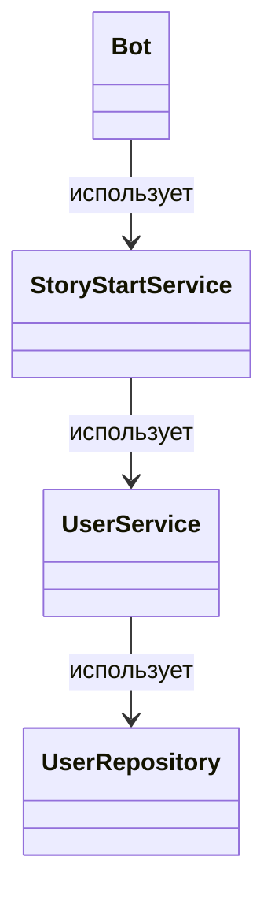
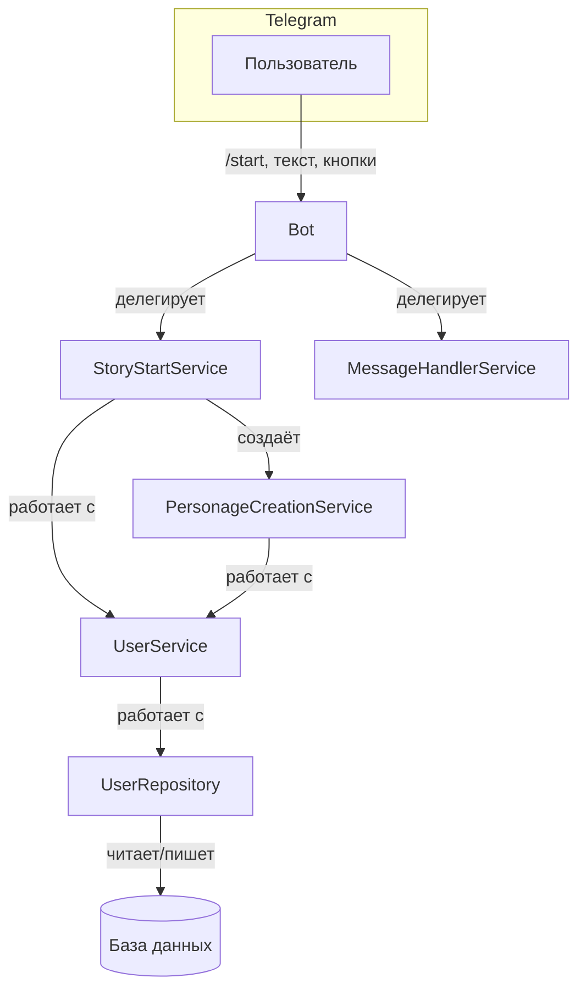
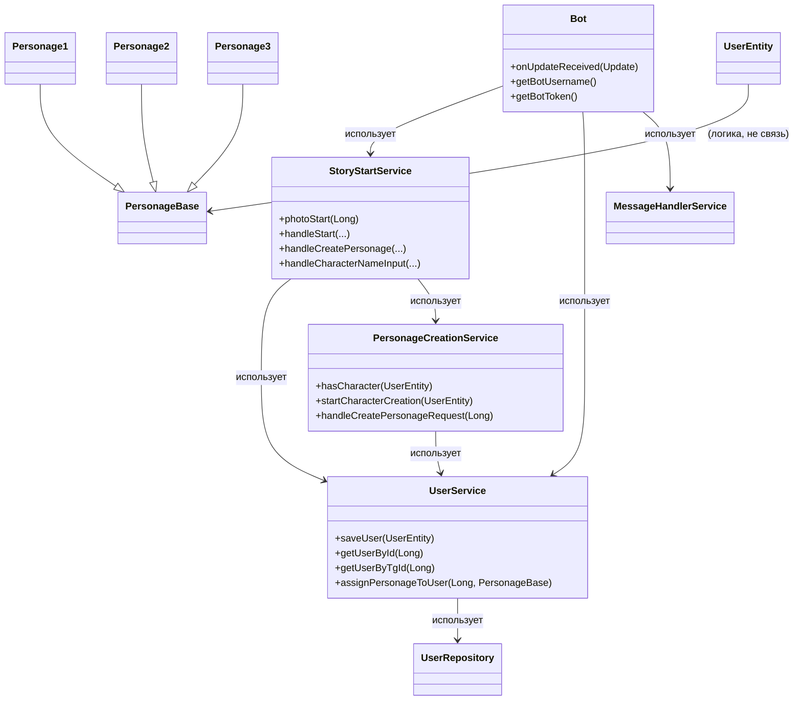
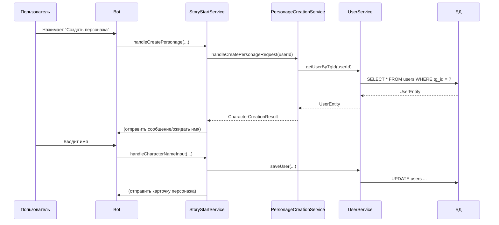

# PROJECT_MANUAL.md

## 1. Многопоточность в проекте: ScheduledExecutorService, потоки и как не словить дедлок

---

### Зачем вообще нужна многопоточность в Telegram-боте?

- **Асинхронные задачи:**  
  Например, отправка напоминаний, периодическая очистка данных, “ожидание” между действиями пользователя, таймеры для квестов.
- **Параллельная обработка:**  
  Если бот обслуживает много пользователей, потоки позволяют не блокировать всех из-за одного тормозящего запроса.
- **Планирование событий:**  
  Например, “через 5 минут после создания персонажа отправить подсказку”.

---

### Как это делается в Java/Spring?

#### ScheduledExecutorService — твой друг и потенциальный источник бессонных ночей

```java
import java.util.concurrent.Executors;
import java.util.concurrent.ScheduledExecutorService;
import java.util.concurrent.TimeUnit;

// Создаём пул из 2 потоков (можно больше, если ты любишь жить опасно)
ScheduledExecutorService scheduler = Executors.newScheduledThreadPool(2);

// Запланировать задачу через 5 секунд
scheduler.schedule(() -> {
    System.out.println("Время вышло! Персонаж устал ждать.");
}, 5, TimeUnit.SECONDS);

// Периодическая задача (каждые 10 минут)
scheduler.scheduleAtFixedRate(() -> {
    System.out.println("Проверяем, не заскучал ли кто-нибудь...");
}, 0, 10, TimeUnit.MINUTES);
```

---

#### Как это выглядит в Spring?

- Можно создать бин с помощью `@Bean` и внедрять его в сервисы.
- Можно использовать `@Scheduled` (Spring Boot) для периодических задач (но для этого нужен отдельный конфиг).

```java
import org.springframework.scheduling.annotation.Scheduled;
import org.springframework.stereotype.Service;

@Service
public class ReminderService {
    // Каждые 10 минут
    @Scheduled(fixedRate = 600_000)
    public void sendReminders() {
        System.out.println("Пора напомнить пользователям, что баги сами себя не найдут!");
    }
}
```
> **Внимание:** чтобы заработало, нужно включить аннотацию `@EnableScheduling` в конфиге.

---

### Типичные грабли и чёрный юмор

- **Дедлоки:**  
  Если два потока ждут друг друга — поздравляю, ты только что написал distributed deadlock simulator.
- **Гонки потоков:**  
  Когда два потока одновременно меняют одного пользователя — результат может быть неожиданным, как баг в пятницу вечером.
- **Пул потоков:**  
  Если сделать пул из одного потока — всё будет работать, но очень медленно. Если из тысячи — твой сервер уйдёт в отпуск.
- **Не забывай завершать пул:**  
  `scheduler.shutdown();` — иначе твой бот будет жить в памяти вечно, как баги в старом коде.

---

### Где это может пригодиться в твоём проекте?

- **Таймеры для квестов:**  
  Например, если пользователь не ответил в течение 5 минут — отправить ему “пинок”.
- **Плановые рассылки:**  
  Поздравления с праздниками, напоминания о дедлайнах, массовые уведомления.
- **Очистка устаревших данных:**  
  Например, удалять неактивных пользователей раз в сутки.

---

### Пример из жизни проекта

> “Пользователь создал персонажа, но не ввёл имя? Через 2 минуты отправь ему мем про прокрастинацию!”

```java
scheduler.schedule(() -> {
    bot.execute(new SendMessage(chatId, "Ты ещё тут? Персонаж ждёт имя, а ты — вдохновения."));
}, 2, TimeUnit.MINUTES);
```

---

**Если хочешь — могу показать, как внедрить это в твой проект на практике.**

---

## 2. Spring, DI и аннотации: магия, которая работает (пока ты не лезешь руками)

---

### Что такое Spring и зачем он вообще нужен?

- **Spring** — это фреймворк, который берёт на себя всю рутину по созданию, связыванию и управлению объектами (бинами).
- **DI (Dependency Injection, внедрение зависимостей)** — это когда ты не создаёшь объекты руками через `new`, а просто говоришь: “Spring, дай мне сервис!” — и он даёт (или не даёт, если ты накосячил с аннотациями).
- **Зачем?** Чтобы твой код был тестируемым, расширяемым и не превращался в “God Object” с кучей new внутри.

---

### Как это выглядит в коде?

```java
@Service // Говорим Spring: “Это сервис, управляй им!”
@RequiredArgsConstructor // Ломбук: “Сгенерируй конструктор для final-полей”
public class UserService {
    private final UserRepository userRepository; // Spring сам внедрит бин UserRepository
}
```

- **@Service** — помечает класс как сервис (бин), который Spring будет создавать и внедрять.
- **@Component** — то же самое, но более общий случай (можно для любого класса).
- **@Repository** — для классов, которые работают с БД.
- **@Controller** — для веб-контроллеров (в боте не используется, но вдруг пригодится).
- **@Autowired** — если хочешь внедрять зависимости не через конструктор, а через поле (но лучше через конструктор, иначе Архитектор будет ругаться).
- **@RequiredArgsConstructor** — от Lombok, генерирует конструктор для всех final-полей (и Spring сам всё внедрит).

---

### Как Spring решает, что и когда создавать?

- При запуске приложения Spring сканирует все классы с нужными аннотациями и создаёт для них “бины” (экземпляры).
- Если твой сервис зависит от другого сервиса — Spring сам найдёт нужный бин и подставит его в конструктор.
- Если где-то не хватает бина — приложение не стартует, а ты получаешь ошибку “No qualifying bean of type...”.

---

### Жизненный цикл бина (на пальцах)

1. **Spring находит класс с @Service/@Component**
2. **Создаёт экземпляр (бин)**
3. **Внедряет зависимости (через конструктор, поле или сеттер)**
4. **Вызывает методы жизненного цикла (если есть)**
5. **Отдаёт бин всем, кто его просит**
6. **Когда приложение завершается — уничтожает бин**

---

### Пример из проекта

```java
@Service
@RequiredArgsConstructor
public class StoryStartService {
    private final UserService userService; // Spring сам внедрит бин UserService
    // ...
}
```

- Ты нигде не пишешь `new UserService()` — Spring сам всё сделает.
- Если забудешь аннотацию — бин не создастся, и всё упадёт с ошибкой.

---

### Схема (Mermaid UML)



---

### Типичные грабли и чёрный юмор

- **Забыл аннотацию @Service/@Component** — бин не создаётся, приложение падает, ты ищешь ошибку 2 часа.
- **Два одинаковых бина** — Spring не знает, какой выбрать, и кидает “NoUniqueBeanDefinitionException”.
- **Внедряешь через поле, а не через конструктор** — тестировать сложно, Архитектор негодует.
- **Циклическая зависимость** — сервис А зависит от Б, а Б — от А. Spring впадает в ступор и падает.

---

### FAQ

- **Q: Можно ли создавать сервисы руками через new?**
  - A: Можно, но тогда Spring не будет управлять этим объектом, и DI работать не будет. Не делай так.
- **Q: Можно ли внедрять бин в static-поле?**
  - A: Нет. Spring не умеет внедрять зависимости в static.
- **Q: Как протестировать сервис?**
  - A: Используй @MockBean или подставь мок руками, если тестируешь без Spring.

---

_Дальше будет: архитектура, UML, FAQ, SQL — всё с примерами, схемами и юмором._ 

---

## 3. Архитектура проекта: слои, связи и почему "всё в одном классе" — это путь в ад

---

### Зачем вообще нужна архитектура?

- Чтобы твой проект не превратился в SpaghettiCode, где никто не понимает, что происходит (даже ты через неделю).
- Чтобы можно было легко добавлять новые фичи, не боясь, что всё сломается.
- Чтобы баги не размножались быстрее, чем студенты на халявной пицце.

---

### Классическая слоистая архитектура (и почему она работает)

1. **Контроллеры (Bot)**
   - Принимают входящие сообщения/команды от Telegram
   - Ничего не знают о бизнес-логике, просто маршрутизируют запросы
2. **Сервисы (Service, StoryStartService, UserService, PersonageCreationService и др.)**
   - Вся бизнес-логика, правила, проверки, создание персонажей, обработка команд
   - Если логика сложная — выноси в отдельный сервис, не бойся длинных названий
3. **Репозитории (UserRepository)**
   - Работа с базой данных: сохранить, найти, удалить пользователя
   - Не должно быть никакой логики, кроме CRUD (Create, Read, Update, Delete)
4. **Модели (UserEntity, PersonageBase, Personage1/2/3)**
   - Просто данные, никакой логики (ну, кроме геттеров/сеттеров и toString)

---

### Как это выглядит в твоём проекте



---

### Почему "всё в одном классе" — это плохо?

- Ты не сможешь протестировать отдельные части (а значит, баги будут жить вечно)
- Любое изменение превращается в минное поле: поменял одно — сломалось другое
- Новые разработчики будут плакать и уходить в отпуск
- Архитектор будет ругаться, а заказчик — платить меньше

---

### Как добавлять новые фичи без боли?

- **Новая команда?** — Добавь метод в Bot, делегируй в новый сервис
- **Новая бизнес-логика?** — Создай отдельный сервис, не бойся длинных названий
- **Новая сущность?** — Добавь модель и репозиторий, не пихай всё в UserEntity

---

### Типичные грабли и чёрный юмор

- **Всё в одном классе:** “Зато быстро!” — через месяц: “Почему всё падает, а багов больше, чем кода?”
- **Сервис знает про базу напрямую:** — “Я просто сохранил тут…” — через неделю: “А почему у меня NullPointerException?”
- **Копипаста логики:** — “Ну я просто скопировал метод…” — через релиз: “Почему баги размножаются?”

---

### FAQ по архитектуре

- **Q: Можно ли объединить сервис и репозиторий?**
  - A: Можно, если хочешь страдать. Не делай так.
- **Q: Можно ли хранить бизнес-логику в Bot?**
  - A: Только если ты любишь дебажить по ночам.
- **Q: Как понять, что пора выносить логику в отдельный сервис?**
  - A: Если метод стал длиннее экрана — пора.

---

_Дальше будет: UML (диаграммы классов и взаимодействий), FAQ, SQL — всё с примерами, схемами и юмором._ 

---

## 4. UML: диаграммы классов и взаимодействий (чтобы не заблудиться в своём же коде)

---

### Зачем нужны UML-диаграммы?

- Чтобы быстро понять, кто с кем и как связан (и кто кого использует)
- Чтобы объяснить новичку, как работает проект, не тратя 2 часа на “ну тут всё просто…”
- Чтобы самому не забыть, что ты тут понаписал

---

### Диаграмма классов (Class Diagram)



---

### Диаграмма взаимодействий (Sequence Diagram)

> “Пользователь создаёт персонажа”



---

### Как читать эти схемы?

- **classDiagram** — показывает, кто кого использует, кто от кого наследуется, какие методы есть у классов
- **sequenceDiagram** — показывает, кто с кем общается при выполнении сценария (например, создание персонажа)

---

### Юмор и грабли

- Если твоя схема похожа на паутину — пора делать рефакторинг
- Если не можешь объяснить схему за 2 минуты — ты её не понимаешь
- Если в sequenceDiagram больше 10 стрелок подряд — возможно, ты пишешь новый Hibernate

---

_Дальше будет: FAQ (типовые вопросы, грабли, советы) и SQL — всё с примерами, схемами и юмором._ 

---

## 5. FAQ: типовые вопросы, грабли, советы (и немного чёрного юмора)

---

### 1. Почему бот не отвечает на /start?
- **Проверь логи:** Скорее всего, не сработал StoryStartService или не внедрился бин.
- **Проверь аннотации:** Забыл @Service или @Component? Spring не простит.
- **Проверь токен:** Если токен неправильный — Telegram молчит, а ты ищешь баги не там.

---

### 2. Почему не создаётся персонаж?
- **Пользователь уже есть в базе:** Бот не даст создать второго персонажа (жизнь — не RPG).
- **Проверь состояние пользователя:** Должно быть "AWAITING_CHARACTER_NAME" для ввода имени.
- **Проверь PersonageCreationService:** Логика создания и проверки персонажа именно там.

---

### 3. Как добавить нового персонажа?
- Создай новый класс, наследник PersonageBase (например, Personage4).
- Добавь методы для карточки (getSendPhotoTheory и т.д.).
- Обнови логику случайного выбора персонажа (getRandomPersonage).
- Не забудь добавить обработку в PhotoService и StoryStartService.

---

### 4. Как добавить новую команду?
- Добавь обработку команды в Bot.onUpdateReceived.
- Делегируй логику в отдельный сервис (не пихай всё в Bot).
- Добавь кнопки в KeyboardService, если нужно.

---

### 5. Как не угробить базу?
- Не делай update/delete без where (иначе “прощай, данные!”).
- Делаешь миграции — делай бэкап.
- Не храни пароли в открытом виде (даже если это тестовый проект).

---

### 6. Как тестировать сервисы?
- Используй @MockBean или Mockito для подмены зависимостей.
- Не тестируй всё через Bot — тестируй сервисы отдельно.
- Пиши unit-тесты для бизнес-логики, а не только для “прошёл ли апдейт”.

---

### 7. Почему всё сломалось после “маленького” рефакторинга?
- Потому что “маленький” рефакторинг — это миф.
- Пиши тесты, делай коммиты почаще, не бойся откатывать изменения.

---

### 8. Как понять, что пора делать рефакторинг?
- Если метод не помещается на экран — пора.
- Если ты боишься трогать старый код — пора.
- Если баги размножаются быстрее, чем ты их чинишь — пора.

---

### 9. Как объяснить новичку, как работает проект?
- Покажи ему этот файл (и схему выше).
- Пусть сначала попробует добавить новую команду или персонажа.
- Если не справился — пусть читает комментарии и логи (и не стесняется спрашивать).

---

### 10. Как не сойти с ума?
- Пиши комментарии (даже если кажется, что всё понятно).
- Не бойся спрашивать и гуглить (StackOverflow — твой друг).
- Помни: даже Архитектор когда-то был джуном.

---

_Дальше будет: SQL (структуры таблиц, примеры запросов, советы по работе с БД)._ 

---

## 6. SQL: структура таблиц, примеры запросов, советы по работе с БД

---

### Пример структуры таблицы пользователей (UserEntity)

```sql
CREATE TABLE users (
    id BIGSERIAL PRIMARY KEY, -- внутренний ID
    tg_id BIGINT UNIQUE NOT NULL, -- Telegram user ID
    character_type VARCHAR(32), -- тип персонажа (Personage1, Personage2, ...)
    character_name VARCHAR(64), -- имя персонажа
    state VARCHAR(32), -- состояние (например, AWAITING_CHARACTER_NAME)
    energy INT, -- энергия персонажа
    -- добавляй новые поля, если нужно
);
```

---

### Примеры SQL-запросов

- **Добавить пользователя:**
  ```sql
  INSERT INTO users (tg_id, character_type, character_name, state, energy)
  VALUES (123456789, 'Personage1', 'Вася', NULL, 8);
  ```

- **Получить пользователя по tg_id:**
  ```sql
  SELECT * FROM users WHERE tg_id = 123456789;
  ```

- **Обновить энергию персонажа:**
  ```sql
  UPDATE users SET energy = 10 WHERE tg_id = 123456789;
  ```

- **Удалить пользователя:**
  ```sql
  DELETE FROM users WHERE tg_id = 123456789;
  ```

- **Очистить всю таблицу (ОСТОРОЖНО!):**
  ```sql
  TRUNCATE TABLE users;
  ```

---

### Советы по работе с БД (и немного чёрного юмора)

- **Делай бэкапы!** — “Я случайно удалил таблицу…” — “Ну, теперь у тебя чистый проект!”
- **Не делай update/delete без where** — иначе “прощай, данные!”
- **Добавляй индексы по tg_id** — иначе поиск будет медленным, как дедлайн в пятницу
- **Не храни пароли в открытом виде** — даже если это тестовый проект
- **Проверяй миграции на тестовой базе** — иначе сюрпризы будут не только у пользователей

---

### Как добавить новое поле в таблицу?

```sql
ALTER TABLE users ADD COLUMN coins INT DEFAULT 0;
```
- Не забудь обновить UserEntity и все сервисы, которые работают с этим полем!

---

### Как сделать дамп и восстановить базу (PostgreSQL)?

- **Сделать дамп:**
  ```bash
  pg_dump -U username -d dbname > backup.sql
  ```
- **Восстановить из дампа:**
  ```bash
  psql -U username -d dbname < backup.sql
  ```

---

### Грабли и мемы

- “Я думал, что TRUNCATE — это как SELECT…” — теперь ты знаешь, что такое боль
- “Я забыл where, но это же dev-база…” — теперь у тебя нет dev-базы
- “Я не делал бэкап, потому что всё работало…” — теперь у тебя есть опыт

---

_На этом блок по теории и практике закончен. Если хочешь — могу добавить примеры миграций, схемы для других сущностей или советы по оптимизации!_ 

---

## 7. Практические наработки: отправка сообщений, викторины, расширение сюжета, миграции, оптимизация

---

### 1. Как отправлять сообщения пользователю в боте

**Текстовое сообщение:**
```java
SendMessage message = new SendMessage(chatId.toString(), "Привет, пользователь!");
bot.execute(message);
```

**Сообщение с клавиатурой:**
```java
SendMessage message = new SendMessage(chatId.toString(), "Выбери вариант:");
message.setReplyMarkup(KeyboardService.getStartKeyboardStatic());
bot.execute(message);
```

**Фото:**
```java
SendPhoto photo = photoService.getStartPhoto(chatId);
bot.execute(photo);
```

**Инлайн-клавиатура:**
```java
SendMessage message = new SendMessage(chatId.toString(), "Создать персонажа?");
message.setReplyMarkup(KeyboardService.getCreatePersonageInlineKeyboard());
bot.execute(message);
```

---

### 2. Как создавать викторины (quiz)

**Пример викторины:**
```java
SendPoll poll = new SendPoll();
poll.setChatId(chatId);
poll.setQuestion("Какой метод добавляет элемент в ArrayList?");
poll.setOptions(Arrays.asList("abb()", "insert()", "add()", "push()"));
poll.setCorrectOptionId(2); // Индекс правильного ответа
poll.setType("quiz");
poll.setExplanation("Правильный ответ: add()");
bot.execute(poll);
```

**Совет:**
- Для каждого нового сюжета делай отдельный метод для викторины (например, getLinkedListQuiz()).
- Не смешивай викторины разных тем в одном сервисе.

---

### 3. Как расширять сюжет (например, LinkedListStoryService)

**Пошагово:**
1. **Создай новый класс:**
   ```java
   @Service
   @RequiredArgsConstructor
   public class LinkedListStoryService {
       // Все методы и логика только для LinkedList!
   }
   ```
2. **Добавь методы для теории, фото, викторин:**
   - getLinkedListTheory(), getLinkedListPhotoTheory(), getLinkedListQuiz(), sendLinkedListTheory() и т.д.
3. **Добавь клавиатуру, если нужно:**
   - В KeyboardService сделай getLinkedListKeyboard().
4. **В Bot/MessageHandlerService делегируй обработку новых команд в этот сервис.**
5. **Не копипасть!** Если логика повторяется — выноси в абстрактные классы/интерфейсы.

**Юмор:**
- Если начнёшь смешивать логику ArrayList и LinkedList — Архитектор лично напишет тебе в Telegram.

---

### 4. Примеры миграций, схемы для других сущностей, советы по оптимизации

**Пример миграции (добавить поле coins):**
```sql
ALTER TABLE users ADD COLUMN coins INT DEFAULT 0;
```

**Схема для новой сущности (например, achievements):**
```sql
CREATE TABLE achievements (
    id BIGSERIAL PRIMARY KEY,
    user_id BIGINT REFERENCES users(id),
    name VARCHAR(64),
    date_earned TIMESTAMP
);
```

**Советы по оптимизации:**
- Не делай сложные join'ы без индексов — иначе база будет тормозить.
- Для часто используемых полей (tg_id, user_id) делай индексы.
- Не храни большие объекты (фото, файлы) в базе — лучше ссылки.
- Периодически делай VACUUM/ANALYZE (для PostgreSQL).
- Пиши тесты для миграций (Flyway, Liquibase).

---

**Если хочешь — могу расписать примеры для других коллекций, схемы для новых таблиц, или дать советы по архитектуре под твои задачи!** 

---

## 8. Примеры для других коллекций (Set, Map, TreeSet, HashMap и т.д.)

---

### Set
```java
Set<String> names = new HashSet<>();
names.add("Вася");
names.add("Петя");
// Множество не хранит дубликаты!
```

### HashSet
```java
HashSet<Integer> numbers = new HashSet<>();
numbers.add(1);
numbers.add(2);
numbers.add(1); // дубликат не добавится
```

### TreeSet
```java
TreeSet<String> sorted = new TreeSet<>();
sorted.add("b");
sorted.add("a");
sorted.add("c");
// Элементы будут отсортированы: a, b, c
```

### Map
```java
Map<Long, String> idToName = new HashMap<>();
idToName.put(123L, "Вася");
idToName.put(456L, "Петя");
String name = idToName.get(123L); // Вася
```

### HashMap
```java
HashMap<String, Integer> scores = new HashMap<>();
scores.put("Вася", 10);
scores.put("Петя", 20);
```

### LinkedHashMap
```java
LinkedHashMap<String, Integer> ordered = new LinkedHashMap<>();
ordered.put("a", 1);
ordered.put("b", 2);
// Сохраняет порядок добавления
```

### TreeMap
```java
TreeMap<String, Integer> sortedMap = new TreeMap<>();
sortedMap.put("b", 2);
sortedMap.put("a", 1);
// Ключи будут отсортированы: a, b
```

---

## 9. Схемы для новых таблиц (инвентарь, квесты)

---

### Инвентарь (inventory)
```sql
CREATE TABLE inventory (
    id BIGSERIAL PRIMARY KEY,
    user_id BIGINT REFERENCES users(id),
    item_name VARCHAR(64),
    quantity INT DEFAULT 1
);
```

### Квесты (quests)
```sql
CREATE TABLE quests (
    id BIGSERIAL PRIMARY KEY,
    user_id BIGINT REFERENCES users(id),
    quest_name VARCHAR(128),
    status VARCHAR(32), -- например, active, completed
    started_at TIMESTAMP,
    completed_at TIMESTAMP
);
```

---

## 10. Советы по архитектуре и чистоте кода для расширения проекта

---
- Для каждого нового сюжета — отдельный StoryService (например, LinkedListStoryService, SetStoryService)
- Все клавиатуры — только в KeyboardService
- Все фото — только в PhotoService
- Все бизнес-правила — только в сервисах, не в Bot и не в сущностях
- Для новых сущностей — отдельные репозитории
- Не копипасть! Если логика повторяется — выноси в абстрактные классы/интерфейсы
- Пиши комментарии и логи, даже если кажется, что всё понятно
- Не бойся делать рефакторинг — лучше сейчас, чем когда всё сломается
- Пиши тесты для сервисов и бизнес-логики

---

## 11. Типичные ошибки и как их избегать (best practices, anti-patterns)

---
- **Бизнес-логика в Bot:** Делегируй всё в сервисы!
- **Огромные методы:** Разбивай на маленькие, понятные куски
- **Дублирование кода:** Выноси общее в базу/интерфейсы
- **Нет комментариев:** Пиши, иначе забудешь сам
- **Нет тестов:** Пиши хотя бы простые unit-тесты
- **Миграции без бэкапа:** Всегда делай бэкап перед ALTER/DELETE/TRUNCATE
- **Нет индексов:** Для часто используемых полей делай индексы
- **Смешивание логики разных коллекций:** Для каждой коллекции — свой сервис
- **Секреты и токены в коде:** Используй переменные окружения или application.yaml

---

## 12. Примеры unit-тестов для сервисов

---

### Пример теста для UserService (JUnit + Mockito)
```java
@SpringBootTest
public class UserServiceTest {
    @MockBean
    private UserRepository userRepository;
    @Autowired
    private UserService userService;

    @Test
    public void testSaveUser() {
        UserEntity user = new UserEntity();
        user.setTgId(123L);
        userService.saveUser(user);
        verify(userRepository, times(1)).save(user);
    }

    @Test
    public void testGetUserByTgId() {
        UserEntity user = new UserEntity();
        user.setTgId(123L);
        when(userRepository.findByTgId(123L)).thenReturn(Optional.of(user));
        UserEntity found = userService.getUserByTgId(123L);
        assertNotNull(found);
        assertEquals(123L, found.getTgId());
    }
}
```

---

**Если нужны примеры для других коллекций, сервисов или тестов — пиши!** 