# 📊 ДИАГРАММЫ И СХЕМЫ СЮЖЕТНОЙ ВЕТКИ

---

## 🔄 ПОЛНАЯ СХЕМА ВЗАИМОДЕЙСТВИЯ

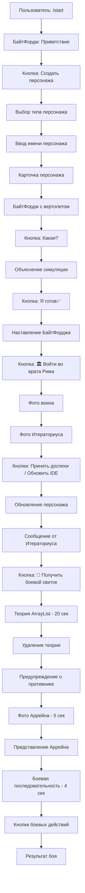

---

## 👥 СХЕМА ПЕРСОНАЖЕЙ

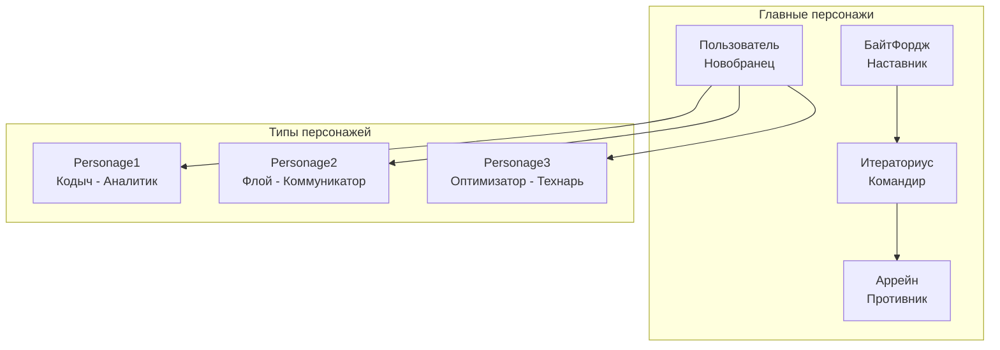

---

## ⚔️ СХЕМА БОЕВОЙ СИСТЕМЫ

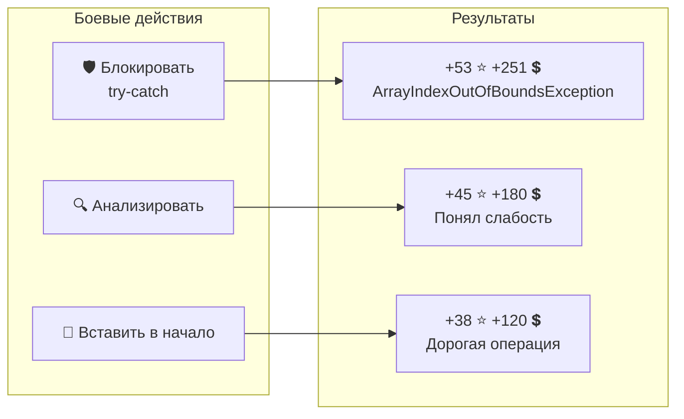

---

## 🕐 СХЕМА ТАЙМЕРОВ

```mermaid
gantt
    title Схема таймеров ArrayList
    dateFormat  X
    axisFormat %s сек
    
    section Теория
    Отправка теории    :0, 0, 1
    Удаление теории    :20, 20, 1
    
    section Противник
    Предупреждение     :20, 20, 1
    Фото Аррейна      :25, 25, 1
    Представление      :25, 25, 1
    
    section Бой
    Боевая последовательность :29, 29, 1
```

---

## 🎮 СХЕМА КНОПОК И ИНТЕРФЕЙСА

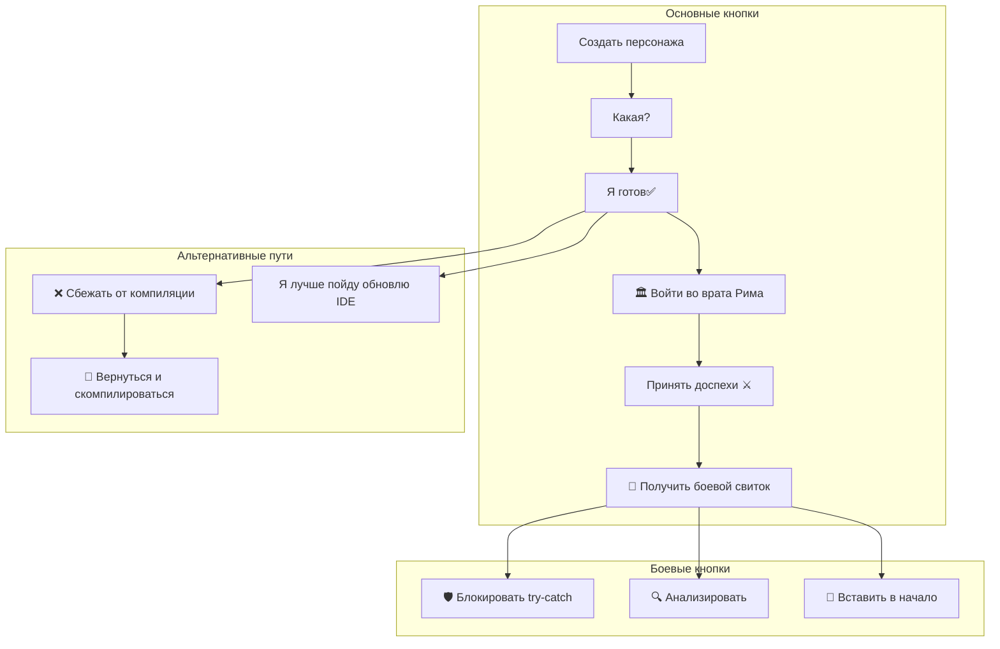

---

## 🏗️ АРХИТЕКТУРНАЯ СХЕМА

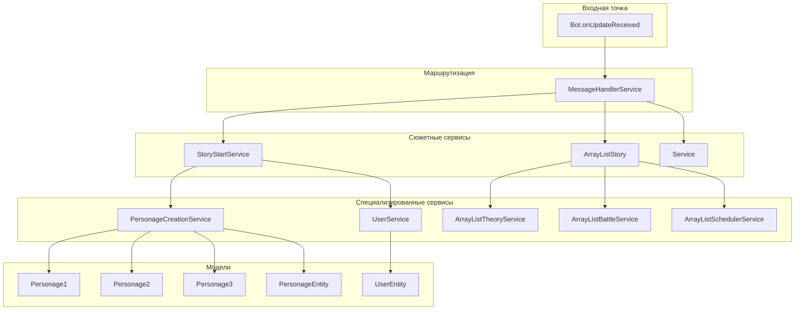

---

## 📊 СХЕМА ПРОГРЕССА ПЕРСОНАЖА

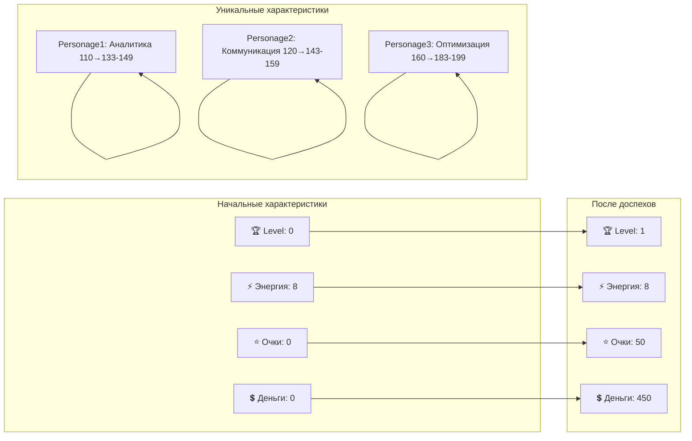

---

## 🎯 СХЕМА СЮЖЕТНЫХ ВЕТОК

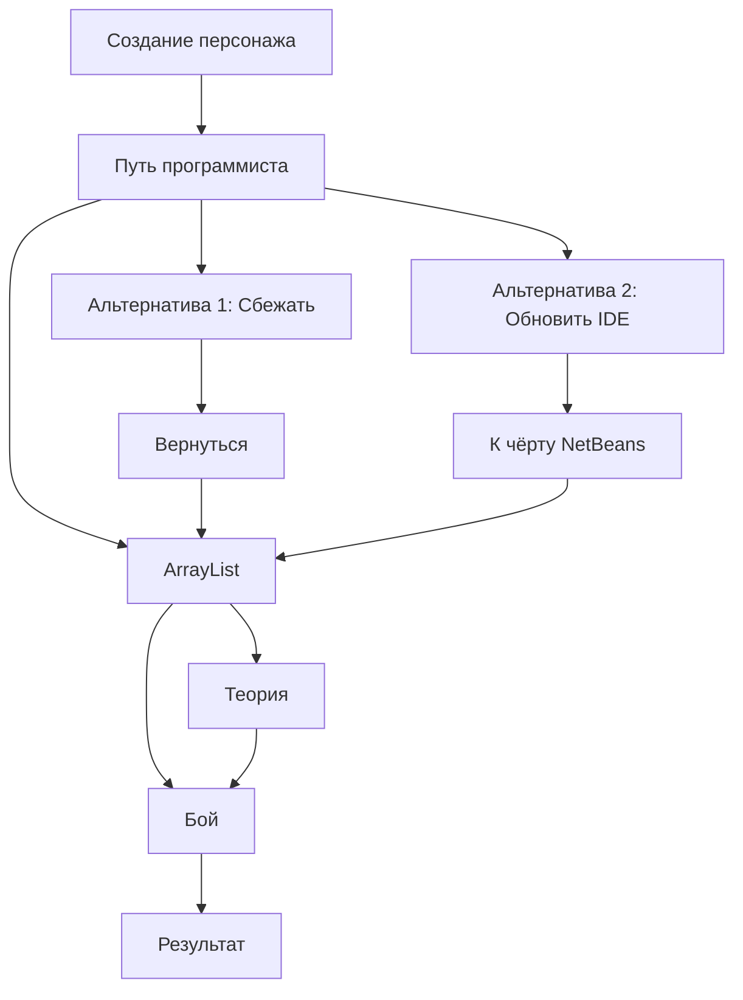

---

## 💬 СХЕМА ДИАЛОГОВ

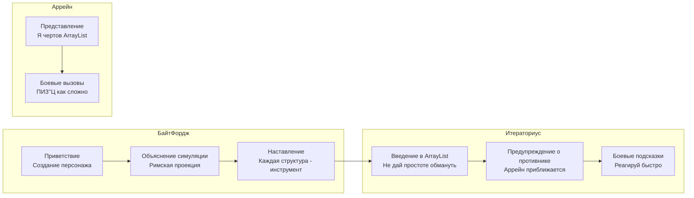

---

## 🎮 СХЕМА ИГРОВОГО ПРОЦЕССА

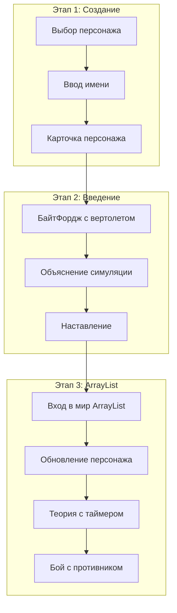

---

## 📈 СХЕМА СТАТИСТИК

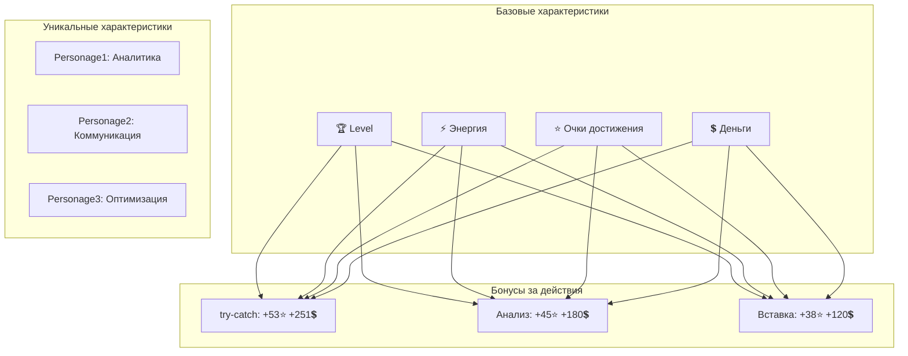

---

## 🎯 ЗАКЛЮЧЕНИЕ

Эти диаграммы показывают:

1. **Полный поток взаимодействия** — от /start до результата боя
2. **Архитектуру персонажей** — типы и их особенности
3. **Боевую систему** — действия и их результаты
4. **Временную схему** — таймеры и последовательность событий
5. **Интерфейс** — все кнопки и их назначение
6. **Техническую архитектуру** — компоненты и их связи
7. **Систему прогресса** — развитие персонажа
8. **Сюжетные ветки** — альтернативные пути
9. **Диалоги** — реплики персонажей
10. **Игровой процесс** — этапы прохождения

Все схемы созданы для наглядного понимания сложной сюжетной ветки бота и могут использоваться для:
- **Разработки** — понимание архитектуры
- **Тестирования** — проверка всех путей
- **Документации** — объяснение пользователям
- **Расширения** — добавление новых веток 