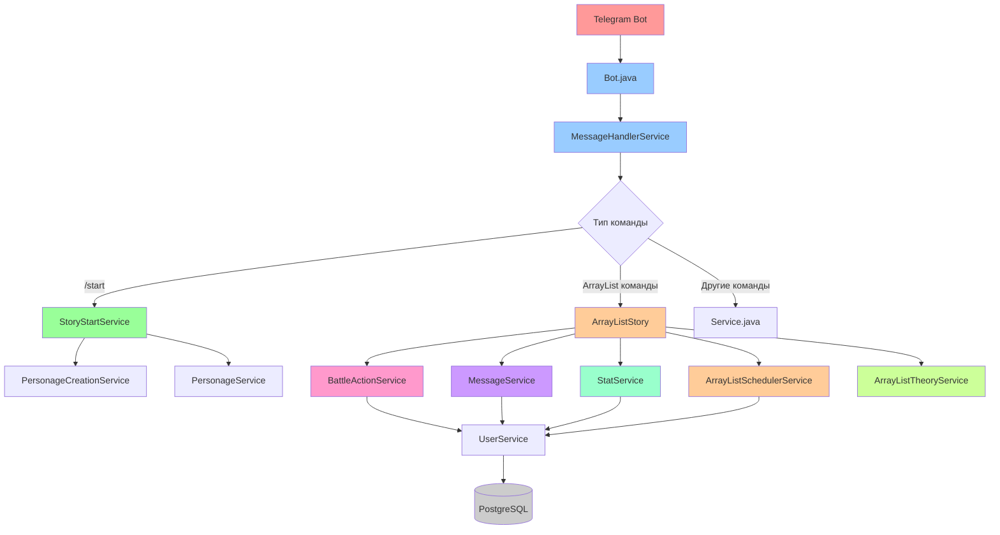
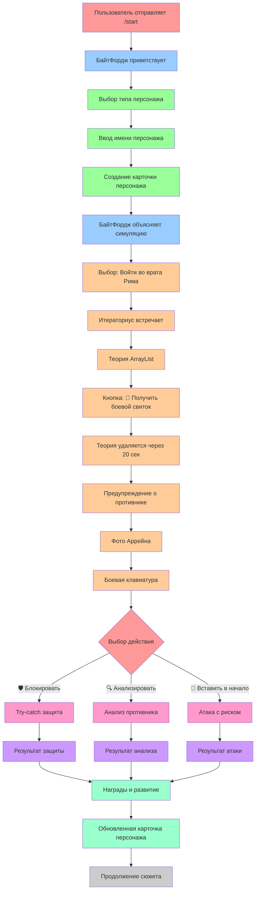
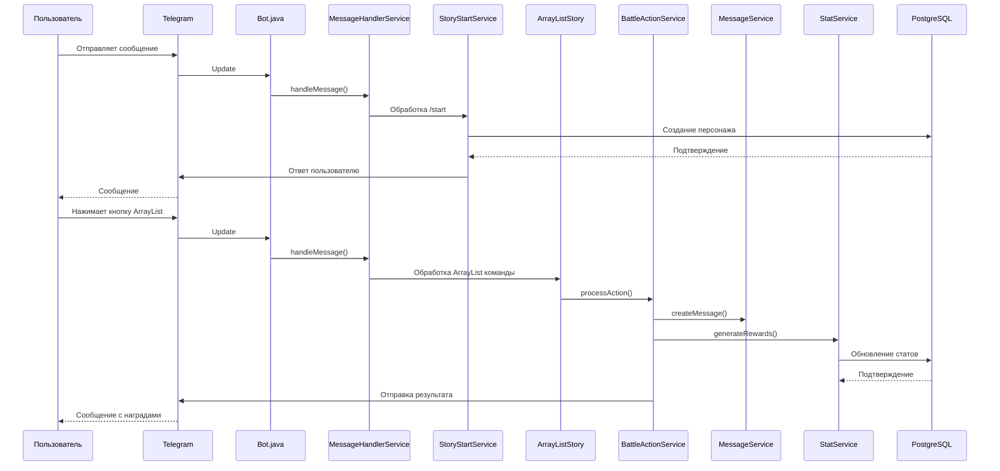
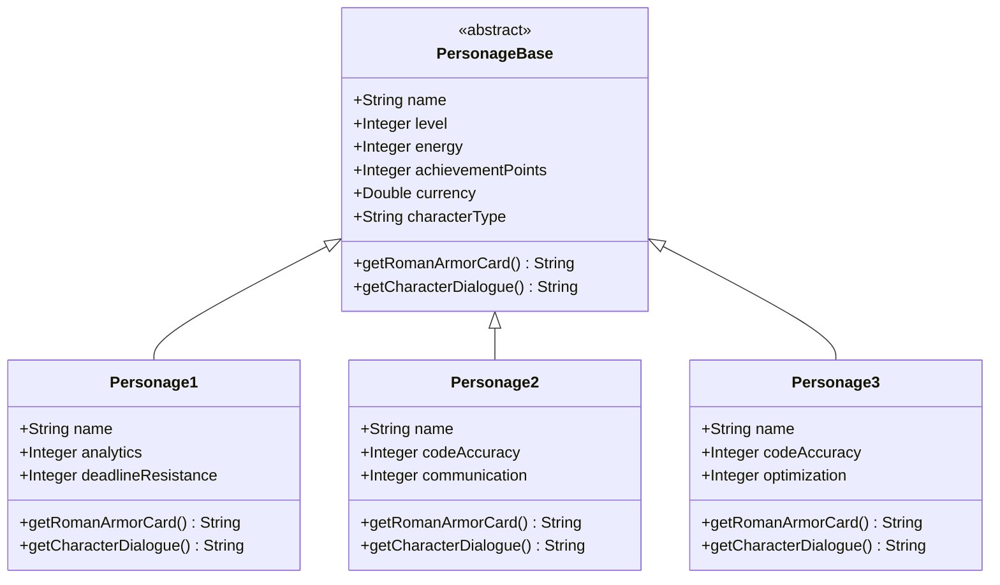
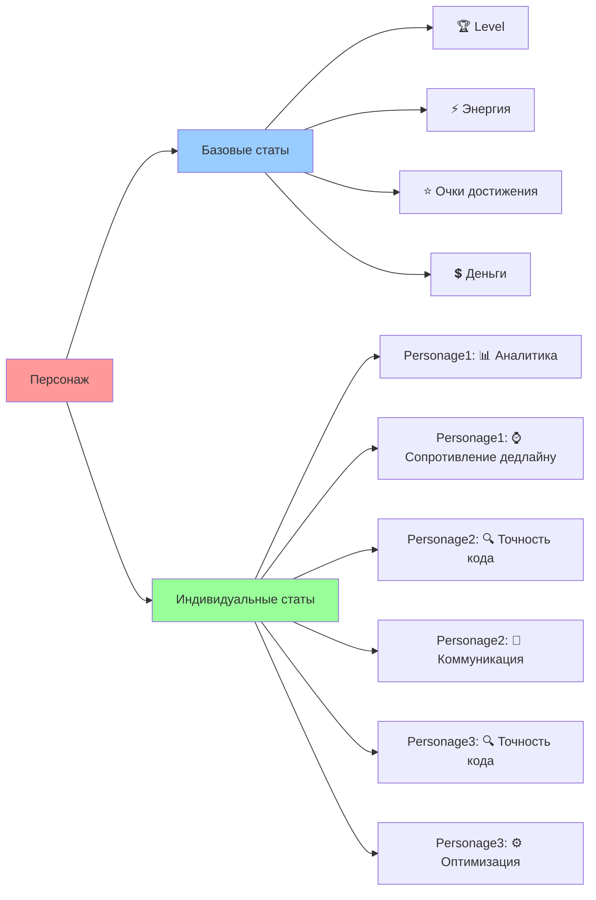
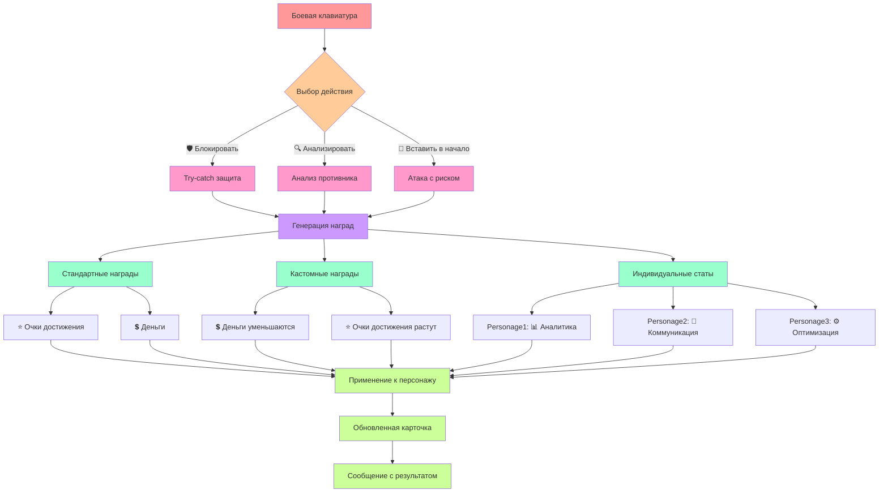
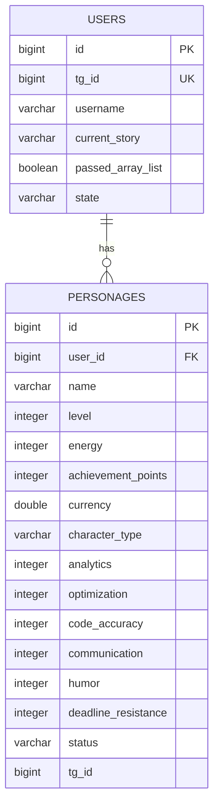
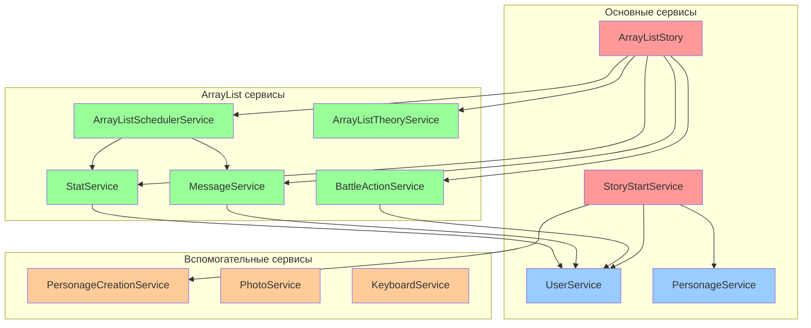
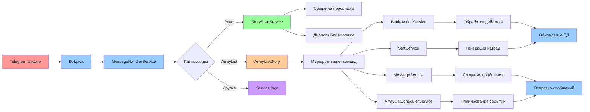

# 📊 ДИАГРАММЫ И СХЕМЫ ПРОЕКТА

---

## 📋 СОДЕРЖАНИЕ

1. [Общая архитектура](#общая-архитектура)
2. [Сюжетная линия](#сюжетная-линия)
3. [Поток данных](#поток-данных)
4. [Система персонажей](#система-персонажей)
5. [Боевая система](#боевая-система)
6. [База данных](#база-данных)
7. [Компоненты системы](#компоненты-системы)

---

## 🏗️ ОБЩАЯ АРХИТЕКТУРА

### Архитектура после рефакторинга:



---

## 🎭 СЮЖЕТНАЯ ЛИНИЯ

### Полный поток сюжета:



---

## 📊 ПОТОК ДАННЫХ

### Обработка сообщений:



---

## 👥 СИСТЕМА ПЕРСОНАЖЕЙ

### Иерархия персонажей:



### Статы персонажей:



---

## ⚔️ БОЕВАЯ СИСТЕМА

### Боевые действия:



### Система наград:

```mermaid
graph LR
    A[Действие игрока] --> B{Тип награды}
    
    B -->|Стандартная| C[Опыт + Деньги]
    B -->|Кастомная| D[Деньги - Опыт +]
    B -->|Индивидуальная| E[Спец. стат +]
    
    C --> F[generateStandardRewards()]
    D --> G[generateCustomStatChanges()]
    E --> H[getIndividualStatForCharacter()]
    
    F --> I[applyStatChanges()]
    G --> I
    H --> I
    
    I --> J[Обновление в БД]
    J --> K[Отображение результата]
    
    style A fill:#ff9999
    style B fill:#ffcc99
    style C fill:#99ffcc
    style D fill:#99ffcc
    style E fill:#99ffcc
    style F fill:#cc99ff
    style G fill:#cc99ff
    style H fill:#cc99ff
    style I fill:#ffcc99
    style J fill:#99ccff
    style K fill:#ccff99
```

---

## 🗄️ БАЗА ДАННЫХ

### ER-диаграмма:



### Схема таблиц:

```mermaid
graph TB
    subgraph "Таблица USERS"
        A1[id - bigint PK]
        A2[tg_id - bigint UK]
        A3[username - varchar]
        A4[current_story - varchar]
        A5[passed_array_list - boolean]
        A6[state - varchar]
    end
    
    subgraph "Таблица PERSONAGES"
        B1[id - bigint PK]
        B2[user_id - bigint FK]
        B3[name - varchar]
        B4[level - integer]
        B5[energy - integer]
        B6[achievement_points - integer]
        B7[currency - double]
        B8[character_type - varchar]
        B9[analytics - integer]
        B10[optimization - integer]
        B11[code_accuracy - integer]
        B12[communication - integer]
        B13[humor - integer]
        B14[deadline_resistance - integer]
        B15[status - varchar]
        B16[tg_id - bigint]
    end
    
    A1 -.->|1:N| B2
    
    style A1 fill:#ff9999
    style A2 fill:#ff9999
    style B1 fill:#99ccff
    style B2 fill:#99ccff
```



---

## 🔧 КОМПОНЕНТЫ СИСТЕМЫ

### Архитектура сервисов:



### Поток обработки команд:



---

## 🚀 ЗАКЛЮЧЕНИЕ

### Ключевые особенности архитектуры:

1. **Модульность** — каждый сервис отвечает за свою область
2. **Масштабируемость** — легко добавлять новые функции
3. **Читаемость** — понятная структура и разделение ответственности
4. **Тестируемость** — изолированные компоненты
5. **Производительность** — эффективная обработка команд

### Преимущества после рефакторинга:

- ✅ **Чистая архитектура** — разделение ответственности
- ✅ **Читаемый код** — понятная структура
- ✅ **Поддерживаемость** — легко добавлять новые функции
- ✅ **Тестируемость** — каждый компонент изолирован
- ✅ **Масштабируемость** — легко расширять функциональность

**Автор: Архитектор (который знает, что хорошая диаграмма — это как хорошая карта: показывает путь и не дает заблудиться)** 😄 